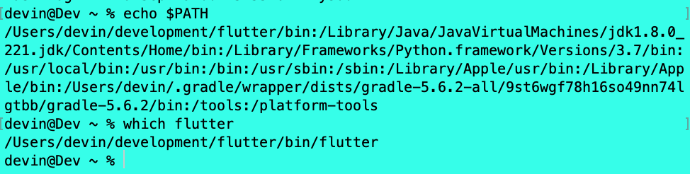
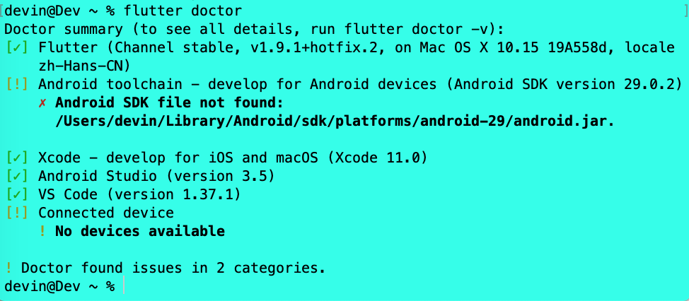
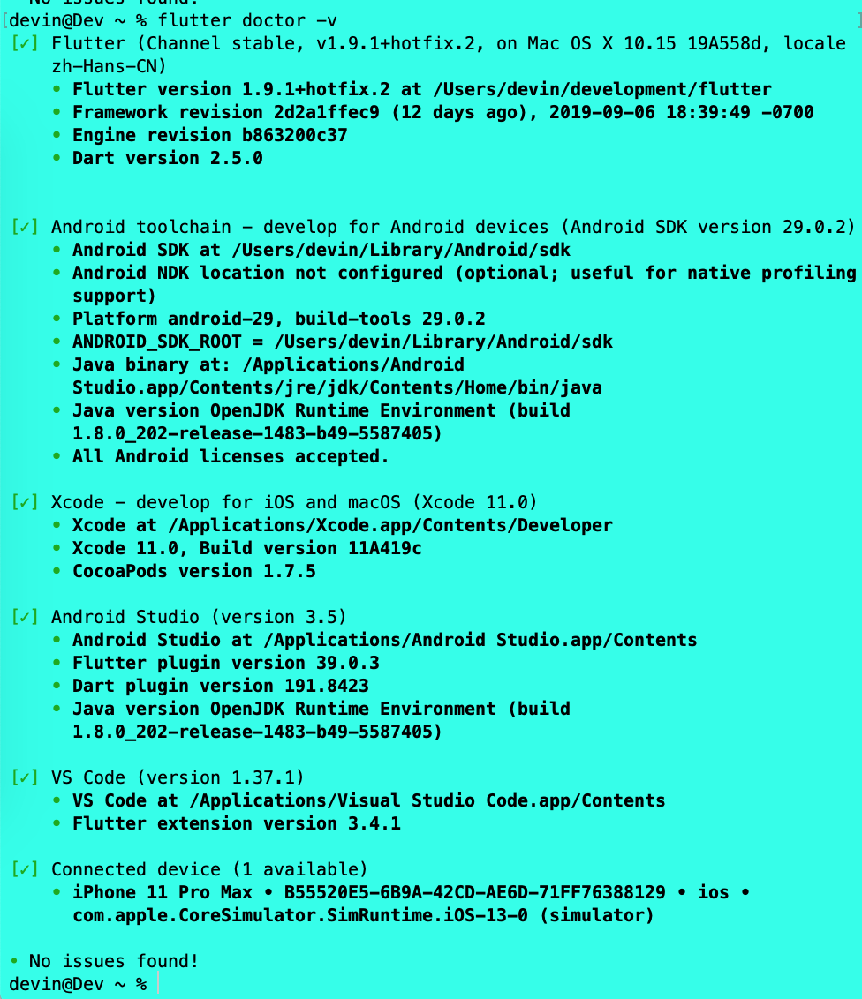

<!-- more -->
我们可以在 macOS，Linux 或 Windows 上进行 Flutter 开发。 虽然我们可以使用任何带有 **Flutter 工具链** 的编辑器，但是 `IntelliJ IDEA`，`Android Studio` 和 `Visual Studio Code` 的 IDE 插件可以简化开发周期。 我们将使用 **VS Code**。

# 1 - 下载 SDK
下载开发机器操作系统对应的安装包，以获取 `Flutter SDK` 的最新稳定版本。这里，我使用的是 Mac 操作系统:

* macOS Catalina
* 10.15 Beta版(19A558d)

## 1.1 系统要求
要安装和运行 Flutter，我们的开发环境必须满足以下最低要求:

* 操作系统: macOS(64位)
* 磁盘空间: 2.8 GB（不包括IDE /工具的磁盘空间）
* 工具: Flutter 依赖于您的环境中可用的这些命令行工具
  * bash
  * curl
  * git 2.x
  * mkdir
  * rm
  * unzip
  * which

## 1.2 获取 Flutter SDK
### 1.2.1 下载以下安装包以获取 Flutter SDK 的最新稳定版本
[Flutter SDK archive for macOS](https://flutter.dev/docs/development/tools/sdk/releases?tab=macos)

我下载的是当前最新版本 `flutter_macos_v1.9.1+hotfix.2-stable`。

### 1.2.2 在目标位置提取文件
```swift
 cd ~/development
 unzip ~/Downloads/flutter_macos_v1.9.1+hotfix.2-stable.zip
```
### 1.2.3 将 Flutter 工具添加到我们的路径(PATH)
**临时路径**
```swift
export PATH="$PATH:`pwd`/flutter/bin"
```
此命令仅为当前终端窗口设置 PATH 变量。

**永久路径**
```swift
export PATH="$PATH:[PATH_TO_FLUTTER_GIT_DIRECTORY]/flutter/bin"
```
我们可以在命令行更新当前会话的 PATH 变量，如临时路径中所示。 但是，我们可能希望永久更新此变量，以便于我们可以在任何终端会话中运行 flutter 命令。

为所有终端会话永久修改此变量的步骤是特定于计算机的。通常，您会在打开新窗口时执行的文件中添加一行。

* 第1步: 确定放置 Flutter SDK 的目录。第 3 步需要用到。
* 第2步: 为你的 shell 打开或创建 `rc` 文件。
  * macOS Mojave(及更早版本) 默认使用 `Bash shell`，因此编辑 `$HOME/.bashrc`。
  * macOS Catalina 默认使用 `Z shell`，因此编辑 `$HOME/.zshrc`。
  * 如果你使用的是其他 shell，则计算机上的文件路径和文件名将有所不同。
* 第3步: 添加以下行并将 `[PATH_TO_FLUTTER_GIT_DIRECTORY]` 更改为克隆 Flutter 的 git repo 的路径:
```swift
export PATH="$PATH:[PATH_TO_FLUTTER_GIT_DIRECTORY]/flutter/bin"
```
我的路径为: 
```swift
export PATH="/Users/devin/development/flutter/bin:$PATH"
```
* 第4步: 运行 `source $ HOME /.<rc file>` 刷新当前窗口，或打开一个新的终端窗口以自动获取文件。
* 第5步: 通过运行以下命令验证 `flutter/bin` 目录现在位于PATH中:
```swift
echo $PATH
```
通过运行以下命令验证 flutter 命令是否可用:
```swift
which flutter
```


### 1.2.4 可选操作: 预先下载开发二进制文件
Flutter 工具根据需要下载特定平台的开发二进制文件。可以通过运行以下方式提前下载iOS和Android二进制文件:
```swift
flutter precache
```

## 1.3 执行 flutter doctor 命令
运行以下命令以查看是否需要安装任何依赖项来完成设置（对于详细输出，请添加-v标志）:
```swift
flutter doctor
```

如图可知，我们需要安装的依赖项如下:

* Flutter SDK
  * 我们已经通过之前的步骤安装成功。
* Android toolchain
  * Android SDK 我们可以通过 Android Studio 的 SDK Manager 来下载安装，这里最新版本需要下载 `android-29`。
* Xcode
  * 通过 AppStore 或者 苹果开发者网站[下载](https://developer.apple.com/download/)即可。
* Android Studio
  * Android Studio 官网[下载](https://developer.android.com/studio)即可。
  * 需要在 Android Studio 客户端上安装 `Flutter plugin` 和 `Dart plugin`。
* VS Code
  * Visual Studio Code 官网[下载](https://code.visualstudio.com/)即可。
  * 需要在 Visual Studio Code 客户端上安装 `Flutter plugin` 和 `Dart plugin`。
* Connected device
  * iOS 可以通过执行 `open -a simulator` 快速打开一个模拟器；Android 可以通过 Android Studio 打开一个 emulator。
下图表示所有依赖项安装完毕:


至此，Flutter 的开发环境就搭建完成了，接下来，我们就可以进行 flutter 的开发了。