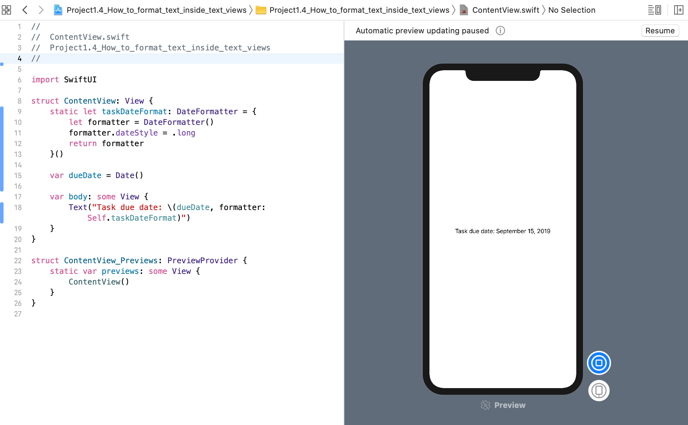

SwiftUI 的文本视图有一个可选的 `formatter` 参数，可以让我们用来自定义数据在标签（label）内的显示方式。这一点很重要，因为在我们的程序中发生某些事情时，通常会为我们更新值，因此通过附加 `formatter`， SwiftUI 可以确保我们的数据以我们期望的方式来正确显示。

例如，这定义了一个日期格式（date formatter）化程序，并使用它来确保 任务日期 以人类可读的形式显示:

```swift
import SwiftUI

struct ContentView : View {
    
    static let taskDateFormatter: DateFormatter = {
        let formatter = DateFormatter()
        formatter.dateStyle = .long
        return formatter
    }()
    
    var dueDate = Date()
    
    var body: some View {
        Text("Task due date: \(dueDate, formatter: Self.taskDateFormatter)")
    }
}

#if DEBUG
struct ContentView_Previews : PreviewProvider {
    static var previews: some View {
        ContentView()
    }
}
#endif
```
运行效果:
