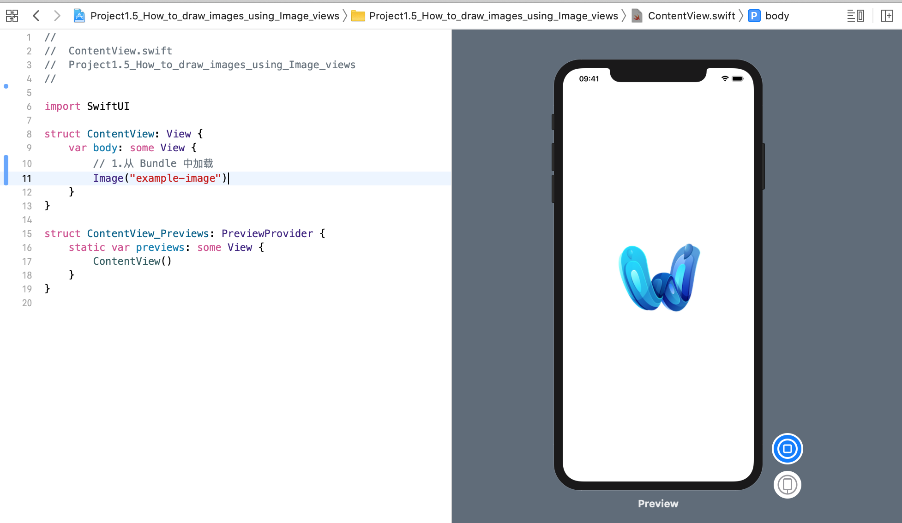
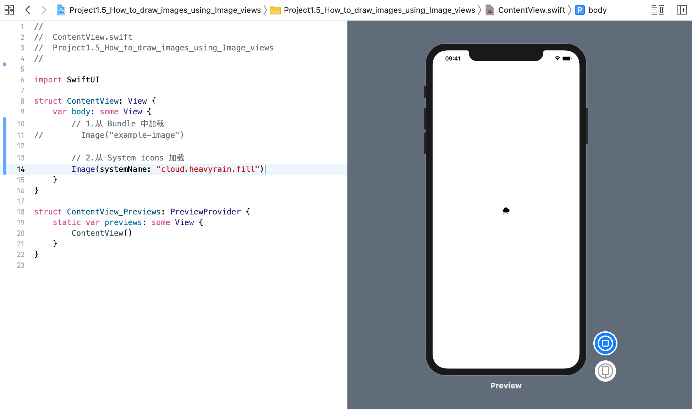
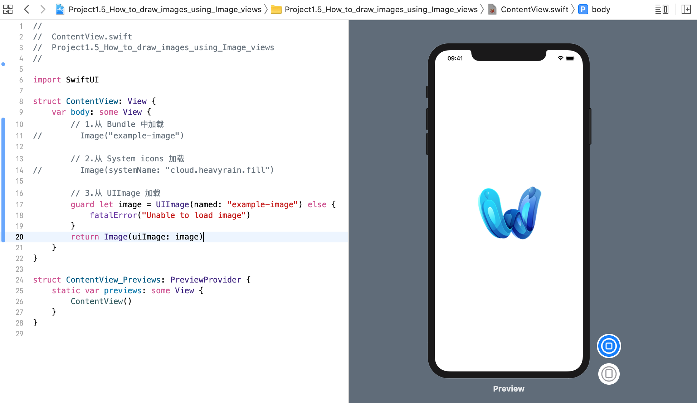
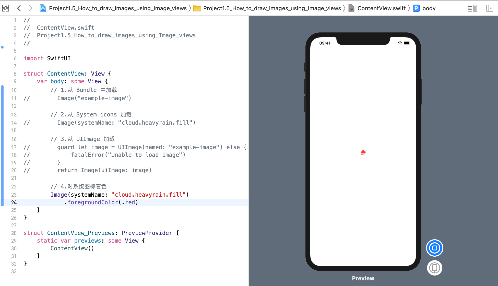
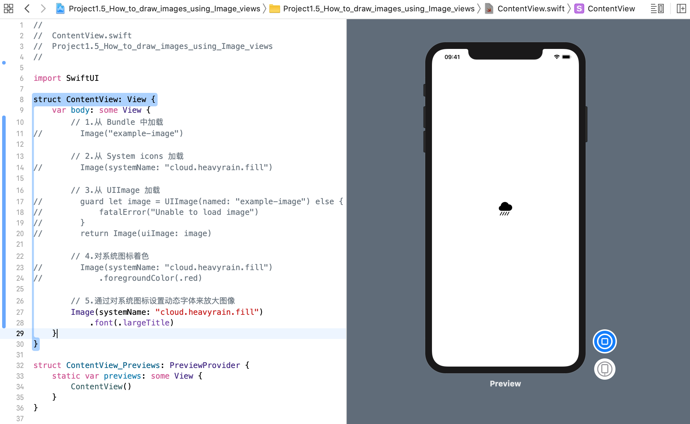

使用图像视图 `Image` 可以在 SwiftUI 布局中渲染图像（images）。我们可以从 `Bundle`、`System icons`、`UIImage` 等中加载图像，但这三个将是最常见的。

### 1. 从 Bundle 加载
要从 Bundle 中加载图像并将其显示在图像视图中，只需使用以下代码:
```swift
var body: some View {
    Image("example-image")
}
```
运行效果:


### 2. 从 System icons 加载
要从苹果旧金山符号集(Apple’s San Francisco Symbol set)中加载图标，请使用 `Image(systemName: )` 初始化器，传入图标字符串进行加载，如下所示:
```swift
Image(systemName: "cloud.heavyrain.fill")
```
运行效果:


### 3. 从 UIImage 加载
最后，可以从现有的 UIImage 创建一个图像视图。因为这需要更多的代码，所以需要显式地使用 return 关键字。
```swift
guard let image = UIImage(named: "example-image") else {
    fatalError("Unable to load image")
}

return Image(uiImage: image)
```
运行效果:


### 4. 通过 foregroundColor 给系统图标着色
如果你使用的是 系统图标集，则返回的图像是 `可缩放` 和 `可着色` 的，这意味着你可以使用 `foregroundColor()` 修改器对图像着色。
```swift
Image(systemName: "cloud.heavyrain.fill")
    .foregroundColor(.red)
```
运行效果:

### 5. 通过给系统图标设置动态文本样式来放大图像
这意味着你可以通过匹配任何 `Dynamic Type` 文本样式，来要求 SwiftUI 放大图像:
```swift
Image(systemName: "cloud.heavyrain.fill")
    .font(.largeTitle)
```
运行效果:
