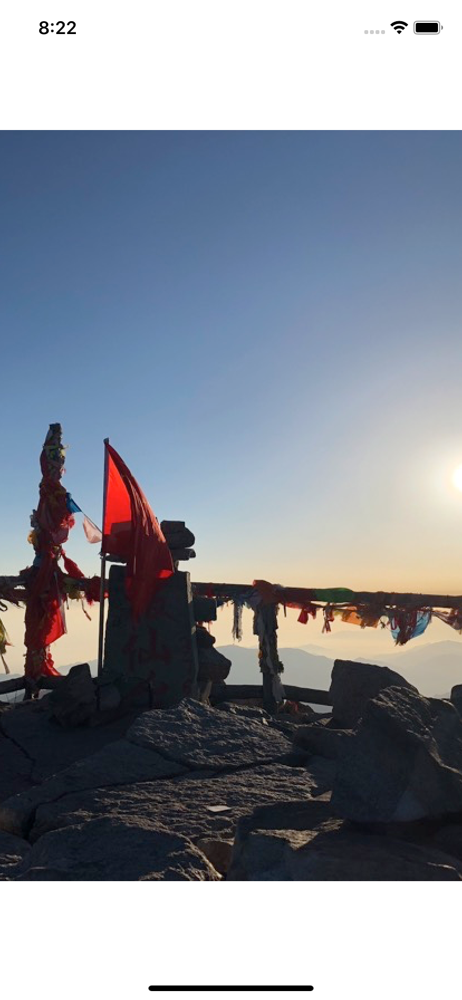
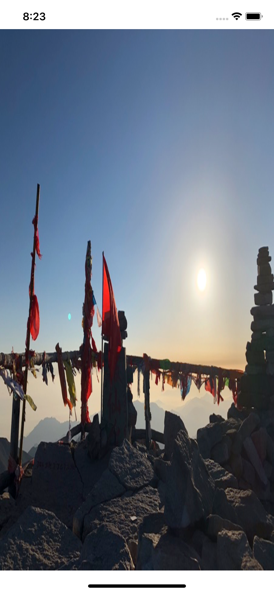
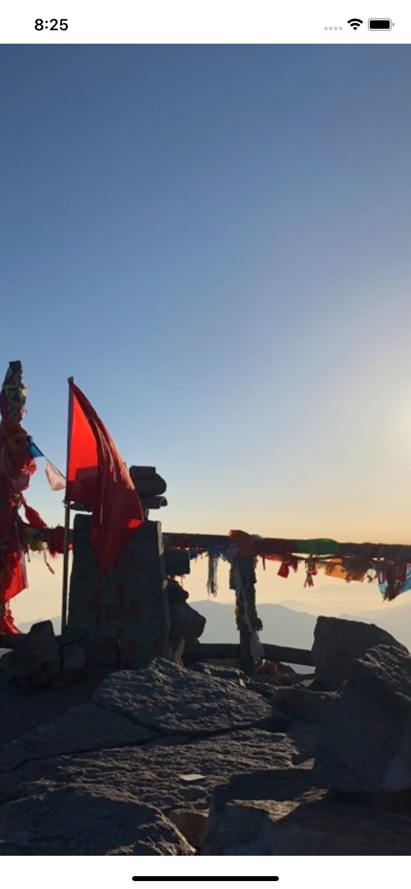

SwiftUI 的 `Image` 能够以不同的方式进行缩放，就像 `UIImageView` 的 _content mode_ 一样。

### 1.默认
默认情况下，图像视图会自动调整其内容的大小，这可能会使它们超出屏幕。
```swift
Image("ba_xian_tai")
```
运行效果:


如果添加了 `resizable()` 修饰符，则图像将自动调整大小，以填充所有可用空间: 
```swift
Image("ba_xian_tai")
    .resizable()
```
运行效果:

然而，这也可能导致图像的原始纵横比失真，因为它将在所有维度上被拉伸任意数量，以使其填充空间。

### 2. .fill 和 .fit
如果要保持其纵横比，应使用 `.fill` 或 `.fit`添加一个`aspectRatio()`修饰符，如下所示：
```swift
Image("ba_xian_tai")
    .resizable()
    .aspectRatio(contentMode: .fill)
```
运行效果:


注意: 在当前的测试版中，有一个bug，.fit内容模式仍然会导致图像被拉伸。