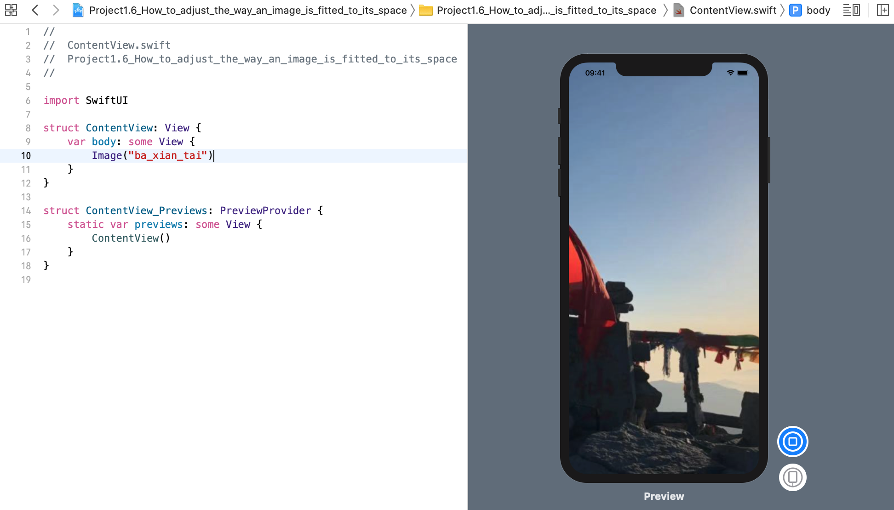
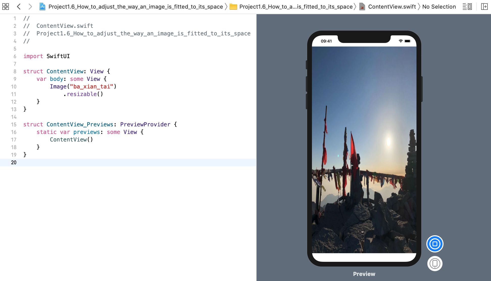
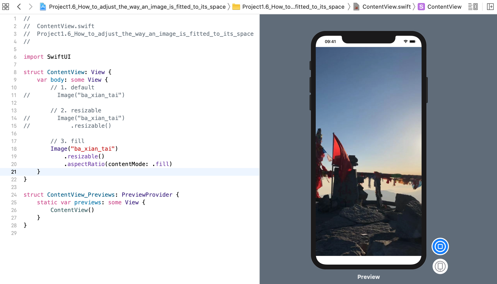
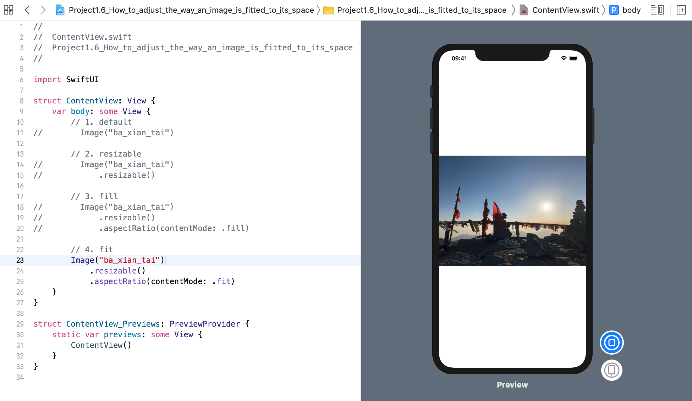

SwiftUI 的 `Image` 视图能够以不同的方式进行缩放，就像 `UIImageView` 的 **content mode** 一样。

### 1.默认
默认情况下，图像视图会根据其内容自动调整大小，这可能会使它们超出屏幕范围。
```swift
Image("ba_xian_tai")
```
效果预览:


如果添加 `resizable()` 修饰符，则图像将自动调整大小，以填充所有可用空间: 
```swift
Image("ba_xian_tai")
    .resizable()
```
效果预览:

然而，这也可能导致图像的原始纵横比失真，因为它将在所有维度上被拉伸任意量，以使其填充空间。

### 2. `.fill` 和 `.fit`
如果要保持其纵横比，应使用 `.fill` 或 `.fit`添加一个`aspectRatio()`修饰符，如下所示:
#### 2.1 fill
```swift
Image("ba_xian_tai")
    .resizable()
    .aspectRatio(contentMode: .fill)
```

效果预览:


#### 2.2 fit
```swift
Image("ba_xian_tai")
    .resizable()
    .aspectRatio(contentMode: .fit)
```

效果预览:
