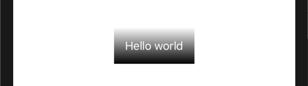
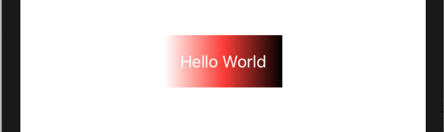
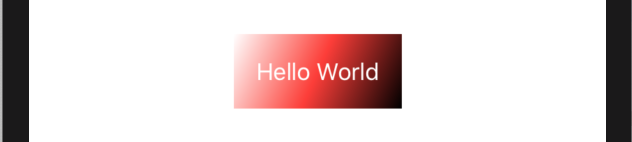

SwiftUI 为我们提供了各种渐变选项（gradient options），所有这些选项都可以以各种方式来使用。例如: 
### 1. 垂直线性渐变
我们使用从白色到黑色的线性渐变来渲染文本视图，如下所示: 
```swift
var body: some View {
    Text("Hello World")
        .padding()
        .foregroundColor(.white)
        .background(LinearGradient(gradient: Gradient(colors: [.white, .black]), startPoint: .top, endPoint: .bottom), cornerRadius: 0)
}
```
运行效果:


颜色被指定为一个数组，我们可以设置任意多我们想要的颜色 - 默认情况下，SwiftUI 将会平均分配这些颜色。所以，我们也可以这样从 白色 -> 红色 -> 黑色 来设置:
```swift
var body: some View {
    Text("Hello World")
        .padding()
        .foregroundColor(.white)
        .background(LinearGradient(gradient: Gradient(colors: [.white, .red, .black]), startPoint: .top, endPoint: .bottom), cornerRadius: 0)
}
```
运行效果:


### 2. 水平线性渐变
要实现一个水平渐变（a horizontal gradient）而不是一个垂直渐变（a vertical one），使用 `.leading` 和 `.trailing` 来作为 _startPoint_ 和 _endPoint_:
```swift
var body: some View {
    Text("Hello World")
       .padding()
       .foregroundColor(.white)
       .background(LinearGradient(gradient: Gradient(colors: [.white, .red, .black]), startPoint: .leading, endPoint: .trailing), cornerRadius: 0)
}
```
运行效果:


### 3. 对角线线性渐变
要实现对角线渐变，可以使用 `.topLeading` 和 `.bottomTrailing` 作为 _startPoint_ 和 _endPoint_:
```swift
var body: some View {
    Text("Hello World")
        .padding()
        .foregroundColor(.white)
        .background(LinearGradient(gradient: Gradient(colors: [.white, .red, .black]), startPoint: .topLeading, endPoint: .bottomTrailing), cornerRadius: 0)
}
```
运行效果:



