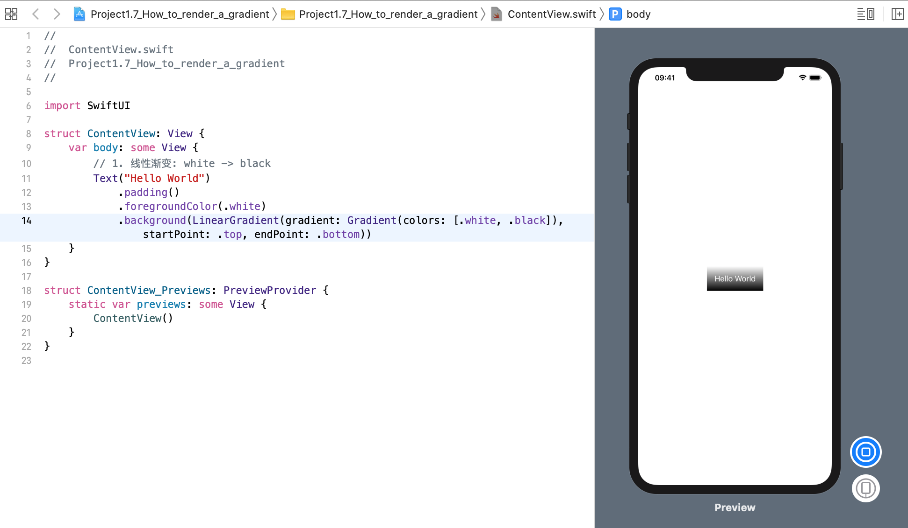
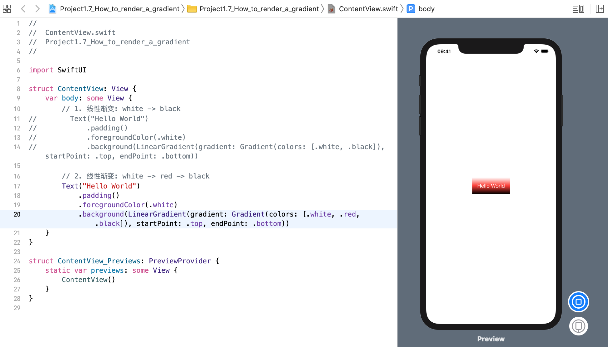
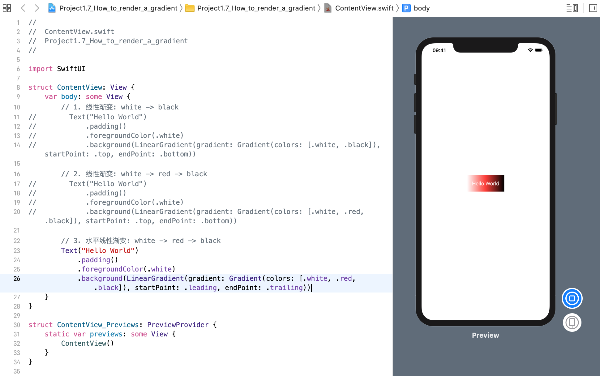
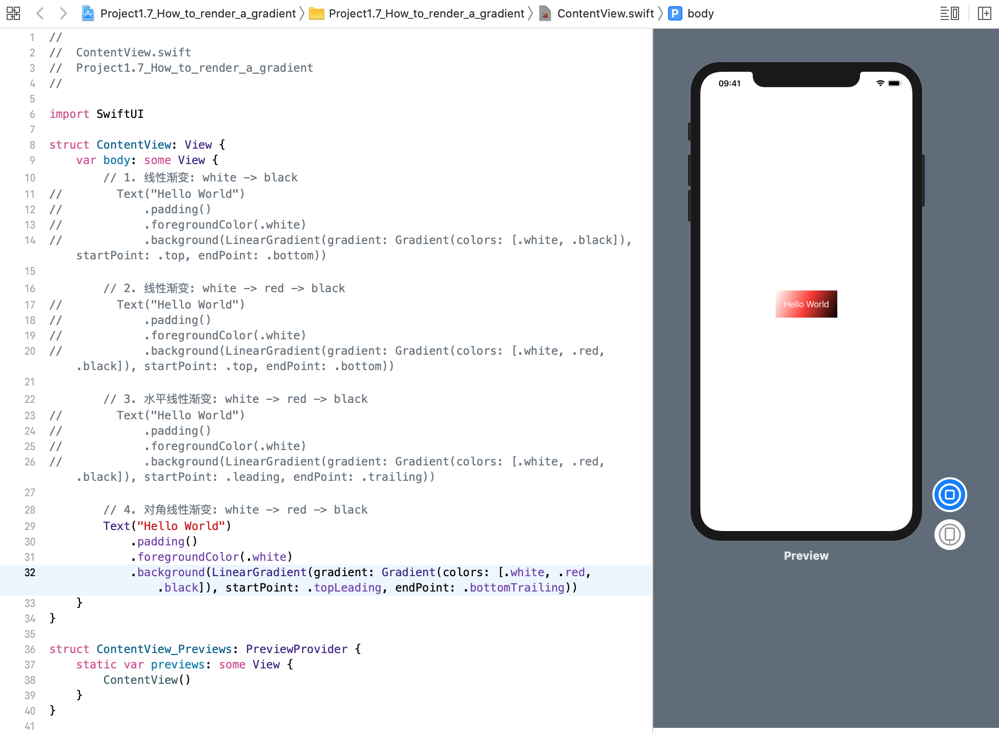
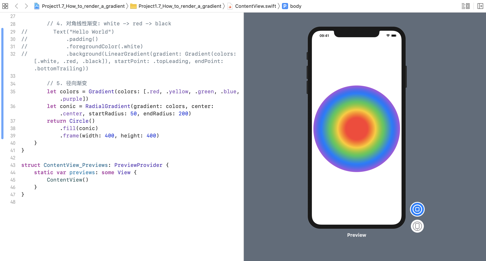
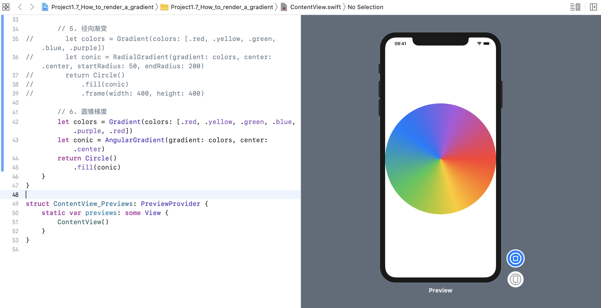
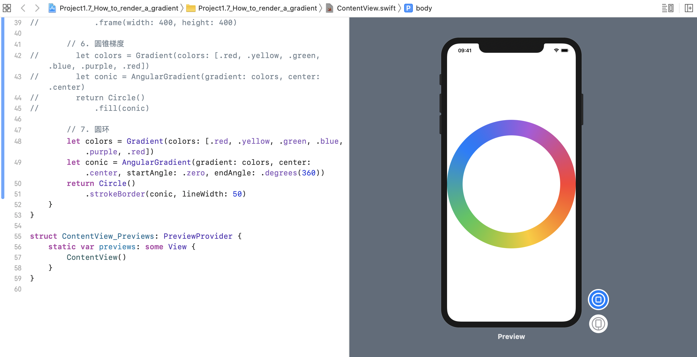

SwiftUI 为我们提供了各种渐变选项（gradient options），所有这些选项都可以以各种方式来使用。例如: 
### 1. 垂直线性渐变
我们使用从白色到黑色的线性渐变来渲染文本视图，如下所示: 
```swift
struct ContentView: View {
    var body: some View {
        // 1. 线性渐变: white -> black
        Text("Hello World")
            .padding()
            .foregroundColor(.white)
            .background(LinearGradient(gradient: Gradient(colors: [.white, .black]), startPoint: .top, endPoint: .bottom))
    }
}
```
效果预览:


颜色被指定为一个数组，我们可以设置任意多我们想要的颜色 - 默认情况下，SwiftUI 将会平均分配这些颜色。所以，我们也可以这样从 白色 -> 红色 -> 黑色 来设置:
```swift
struct ContentView: View {
    var body: some View {
        // 2. 线性渐变: white -> red -> black
        Text("Hello World")
            .padding()
            .foregroundColor(.white)
            .background(LinearGradient(gradient: Gradient(colors: [.white, .red, .black]), startPoint: .top, endPoint: .bottom))
    }
}
```
效果预览:


### 2. 水平线性渐变
要实现一个水平渐变（a horizontal gradient）而不是一个垂直渐变（a vertical one），使用 `.leading` 和 `.trailing` 来作为 _startPoint_ 和 _endPoint_:
```swift
struct ContentView: View {
    var body: some View {
        // 3. 水平线性渐变: white -> red -> black
        Text("Hello World")
            .padding()
            .foregroundColor(.white)
            .background(LinearGradient(gradient: Gradient(colors: [.white, .red, .black]), startPoint: .leading, endPoint: .trailing))
    }
}
```
效果预览:


### 3. 对角线线性渐变
要实现对角线渐变，可以使用 `.topLeading` 和 `.bottomTrailing` 作为 _startPoint_ 和 _endPoint_:
```swift
struct ContentView: View {
    var body: some View {
        // 4. 对角线性渐变: white -> red -> black
        Text("Hello World")
            .padding()
            .foregroundColor(.white)
            .background(LinearGradient(gradient: Gradient(colors: [.white, .red, .black]), startPoint: .topLeading, endPoint: .bottomTrailing))
    }
}
```
效果预览:


### 4. 径向渐变
对于其他渐变样式，请尝试 `RadialGradient` 或 `AngularGradient`。 
例如，这将创建一个从圆心开始到边缘的各种颜色的径向渐变:
```swift
struct ContentView: View {
    var body: some View {
        // 5. 径向渐变
        let colors = Gradient(colors: [.red, .yellow, .green, .blue, .purple])
        let conic = RadialGradient(gradient: colors, center: .center, startRadius: 50, endRadius: 200)
        return Circle()
            .fill(conic)
            .frame(width: 400, height: 400)
    }
}
```
效果预览:


### 5. 角度渐变(圆锥梯度)
这就形成一个角梯度（通常称为圆锥梯度），通过各种颜色然后返回到开始循环:
```swift
struct ContentView: View {
    var body: some View {
        // 6. 圆锥梯度
        let colors = Gradient(colors: [.red, .yellow, .green, .blue, .purple, .red])
        let conic = AngularGradient(gradient: colors, center: .center)
        return Circle()
            .fill(conic)
    }
}
```
效果预览:


### 6. 角度渐变(圆环)
由于所有三种渐变类型都符合 `ShapeStyle` 协议，因此可以将它们用于背景，填充和笔触。 例如，这使用我们的彩虹圆锥形渐变作为圆的粗内部笔画：
```swift
struct ContentView: View {
    var body: some View {
        // 7. 圆环
        let colors = Gradient(colors: [.red, .yellow, .green, .blue, .purple, .red])
        let conic = AngularGradient(gradient: colors, center: .center, startAngle: .zero, endAngle: .degrees(360))
        return Circle()
            .strokeBorder(conic, lineWidth: 50)
    }
}
```
效果预览:
