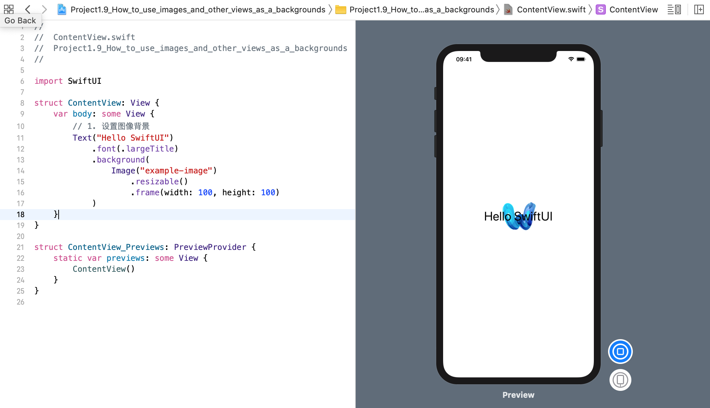
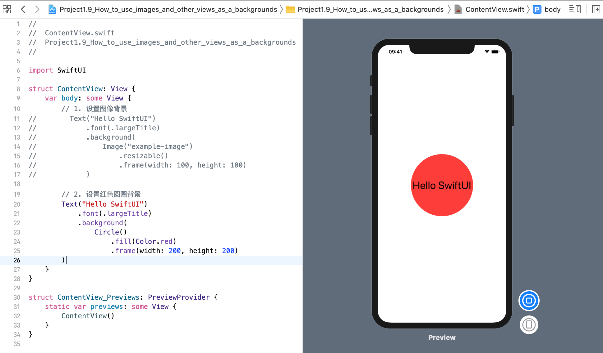
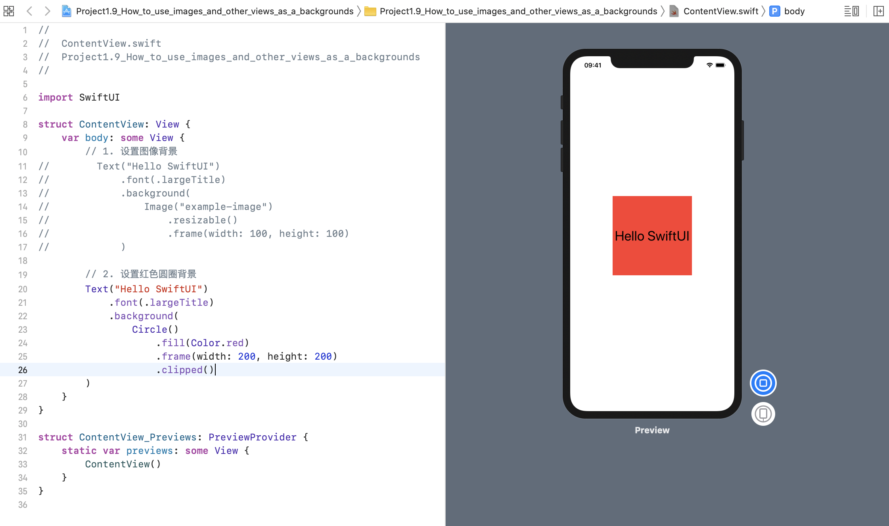

我们可以使用相同的 `background()` 修饰符来设置背景图像，而不是设置背景颜色。
### 1. 给文本视图设置图像背景
例如: 现在，我们要创建一个大字体的文本视图，然后在其后面放置一个 `100x100 的图像`:
```swift
struct ContentView: View {
    var body: some View {
        // 1. 设置图像背景
        Text("Hello SwiftUI")
            .font(.largeTitle)
            .background(
                Image("example-image")
                    .resizable()
                    .frame(width: 100, height: 100)
            )
    }
}
```
效果预览:


### 2. 给文本视图设置一个红色圆圈作为背景
在 SwiftUI 中，背景 View 并不一定是一个图像，实际上我们可以使用任何类型的视图作为背景。
例如: 现在将创建相同的文本视图，然后在其后面放置一个 `200x200 的红色圆圈`: 
```swift
struct ContentView: View {
    var body: some View {
        // 2. 设置红色圆圈背景
        Text("Hello SwiftUI")
            .font(.largeTitle)
            .background(
                Circle()
                    .fill(Color.red)
                    .frame(width: 200, height: 200)
        )
    }
}
```
效果预览:


默认情况下，背景视图会自动占用尽可能多的空间以完全可见，但如果需要，可以使用 `clipped(`) 修饰符将其剪裁为父视图的大小：
```swift
var body: some View {
    Text("Hello SwiftUI")
        .font(.largeTitle)
        .background(
            Circle()
                .fill(Color.red)
                .frame(width: 200, height: 200)
                .clipped()
        )
}
```
效果预览:


明确地说，您可以使用任何视图作为背景，例如，如果需要，可以使用另一个文本视图。