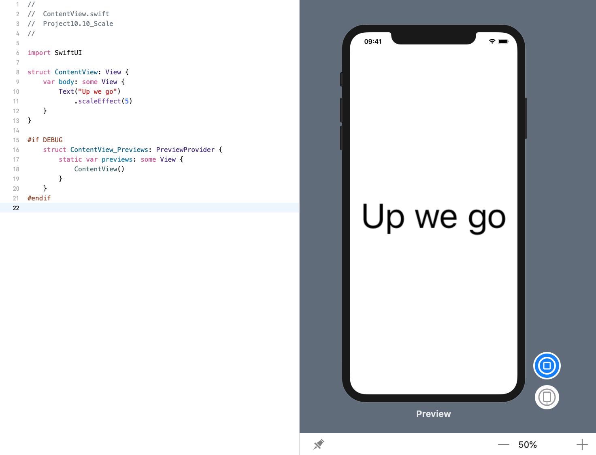
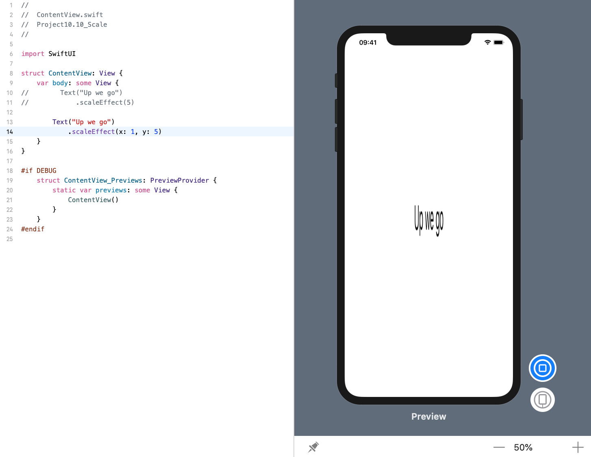
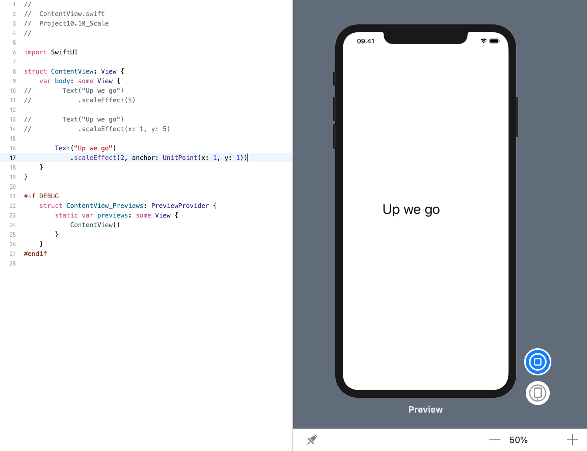

<!-- more -->
### 1. 初识
SwiftUI的 `scaleEffect()` 修改器允许我们自由地增大或减小视图的大小。

### 2. 放大视图
例如，我们可以将文本视图设置为常规大小的五倍，如下所示:
```swift
struct ContentView: View {
    var body: some View {
        Text("Up we go")
            .scaleEffect(5)
    }
}
```


### 3. 独立缩放XY
如果需要，可以独立缩放X和Y尺寸，从而可以挤压以下视图:
```swift
struct ContentView: View {
    var body: some View {
        Text("Up we go")
            .scaleEffect(x: 1, y: 5)
    }
}
```


### 4. 设置锚点
如果您想要更多控制，可以为此缩放指定锚点，如下所示:
```swift
struct ContentView: View {
    var body: some View {
        Text("Up we go")
            .scaleEffect(2, anchor: UnitPoint(x: 1, y: 1))
    }
}
```

这使得文本视图两倍于常规大小，从右下角缩放。