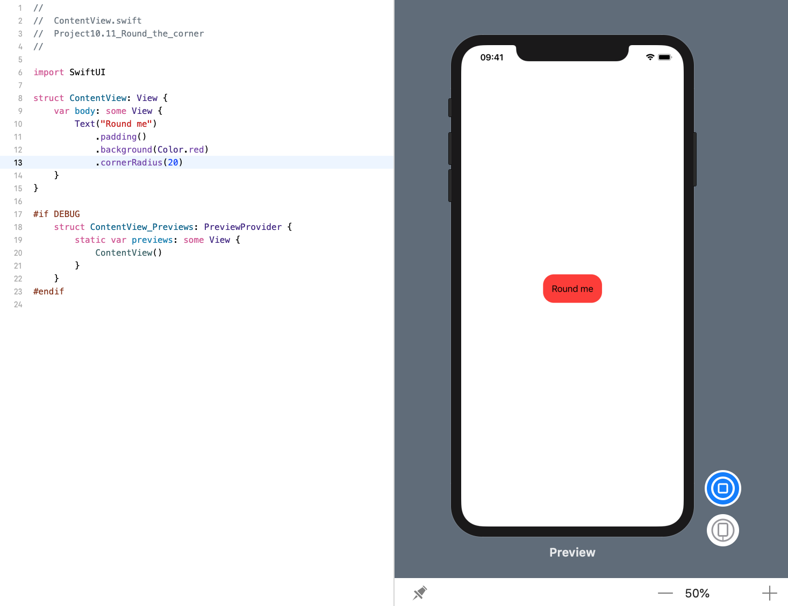

<!-- more -->
通过 `cornerRadius()` 修改器，我们可以给任何 SwiftUI 视图设置圆角。这需要一个简单地值来限定如何明确地成圆。

因此，我们可以创建一个25点圆角的文本视图，如下所示:
```swift
struct ContentView: View {
    var body: some View {
        Text("Round me")
            .padding()
            .background(Color.red)
            .cornerRadius(20)
    }
}
```
效果预览:
