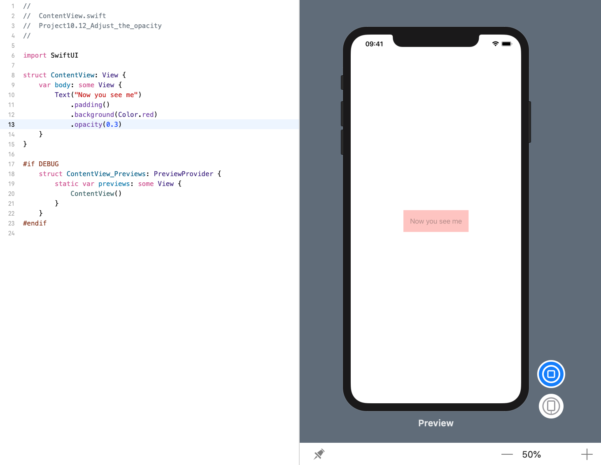

<!-- more -->
通过 `opacity()` 修改器，我们可以将任何 SwiftUI 视图设置成部分或全部透明。它接收 _0(完全不可见)_ 到 _1(完全不透明)_ 之间的值。就像 UIKit 中 `UIView` 的 `alpha` 属性一样。

例如: 下面代码创建一个带有红色背景的文本视图，然后给它30％的不透明度:
```swift
struct ContentView: View {
    var body: some View {
        Text("Now you see me")
            .padding()
            .background(Color.red)
            .opacity(0.3)
    }
}
```
效果预览:
