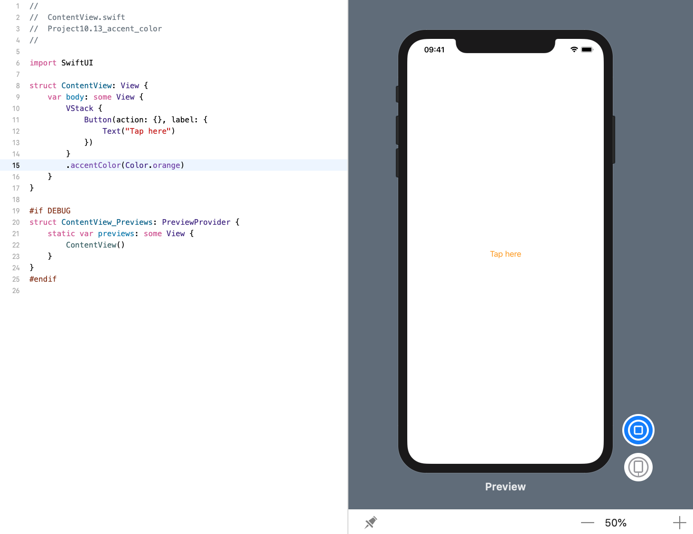

<!-- more -->
iOS 使用 `tints colors` 为应用程序提供协调的主题，SwiftUI 中的 `accent colors` 也提供了相同的功能。就像在 UIKit 中一样，当您设置一个视图的 `accent color` 时，它会影响其中的所有内容，因此如果您设置顶级控件的 `accent color`，那么一切都会变色。

例如，下面代码会在 `VStack` 中创建一个按钮，然后给它一个橙色的强调颜色:
```swift
struct ContentView: View {
    var body: some View {
        VStack {
            Button(action: {}, label: {
                Text("Tap here")
            })
        }
        .accentColor(Color.orange)
    }
}
```
效果预览:
