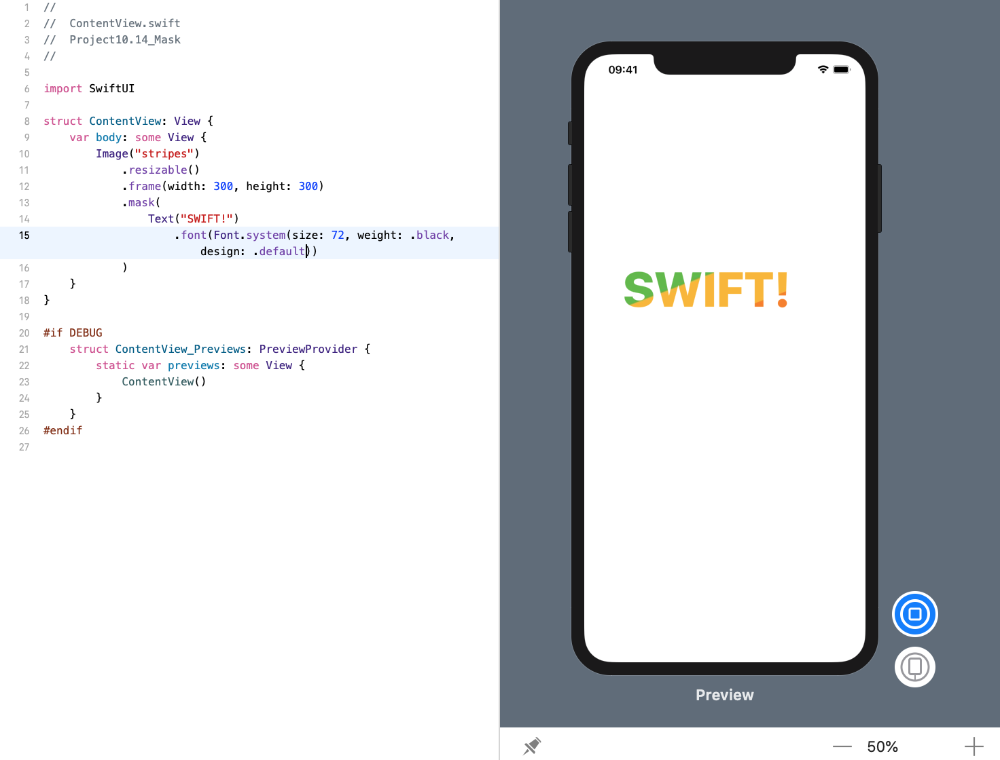

<!-- more -->
SwiftUI 为我们提供了 `mask()` 修改器，用于将一个图像作为另一个视图的蒙版，这意味着我们可以使用文本来作为图像的蒙版，或使用图像作为图像的蒙版，或更多。

例如，下面代码会创建一个 `300x300` 的条纹图像，然后使用文本 "SWIFT!" 对其进行遮罩，以便字母充当图像的剪切区域:
```swift
struct ContentView: View {
    var body: some View {
        Image("stripes")
            .resizable()
            .frame(width: 300, height: 300)
            .mask(
                Text("SWIFT!")
                    .font(Font.system(size: 72, weight: .black, design: .serif))
            )
    }
}
```
效果预览:
 
