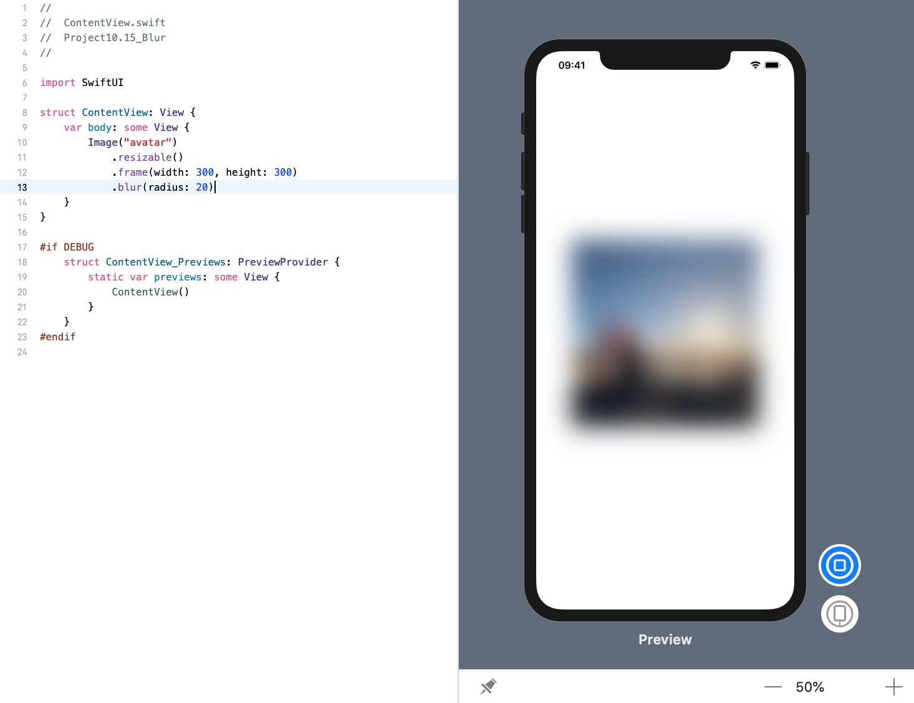
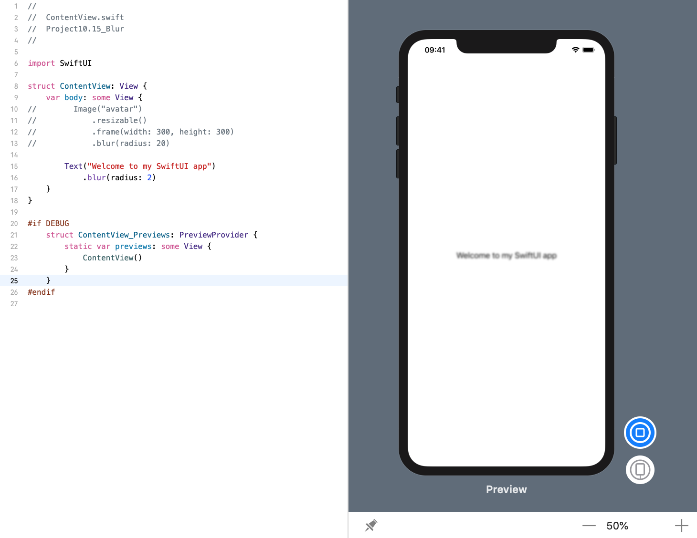

<!-- more -->
### 1. 初识
`blur()` 修改器允许我们根据自己的选择对视图应用实时高斯模糊。

### 2. 给图像设置模糊
例如: 下面代码会创建一个 `300x300` 的个人资料图片，然后添加一个20点的高斯模糊:
```swift
struct ContentView: View {
    var body: some View {
        Image("avatar")
            .resizable()
            .frame(width: 300, height: 300)
            .blur(radius: 20)
    }
}
```
效果预览:


### 3. 给文本设置模糊
我们可以模糊我们想要的任何内容，包括文本视图:
```swift
struct ContentView: View {
    var body: some View {
        Text("Welcome to my SwiftUI app")
            .blur(radius: 2)
    }
}
```
效果预览:
