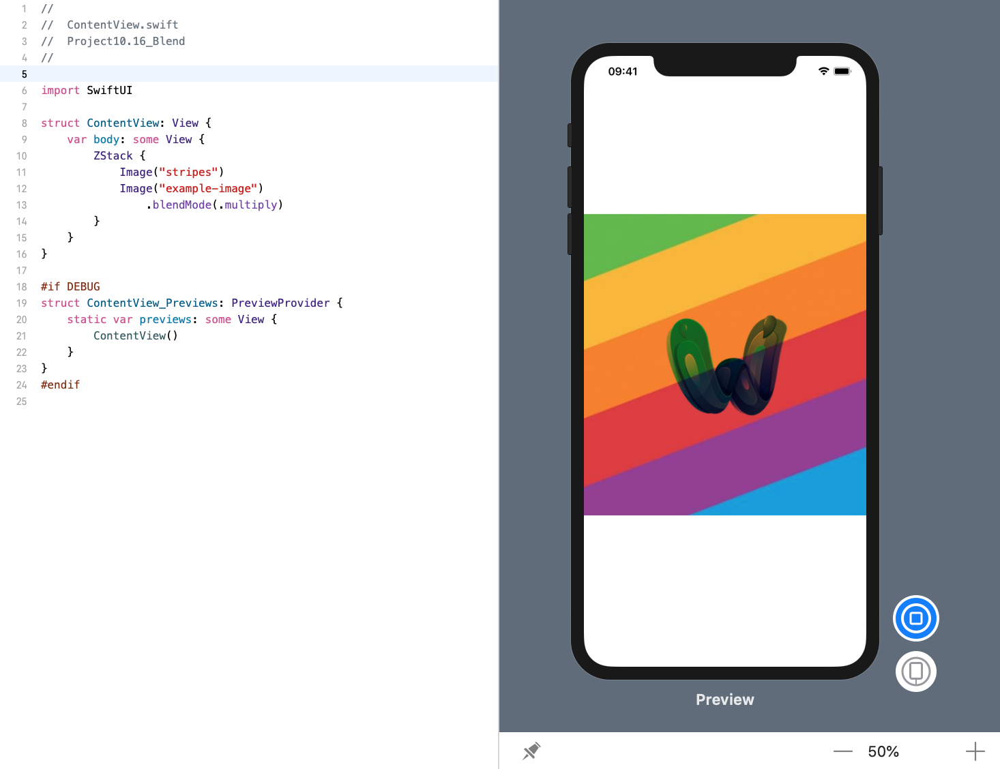

<!-- more -->
将一个视图放在另一个视图上时，可以使用 `blendMode()` 修改器控制它们重叠的方式。 这包含多种可以将颜色混合在一起的方法，例如使用它们的差异或使用颜色刻录 - 如果您之前使用过 Core Graphics 或类似 Photoshop，这些方法会很熟悉。

为了证明这一点，我们可以创建一个内部有两个图像的 `ZStack` ，其中第二个具有 `.multiply` 混合模式，以便使其后面的颜色变暗:
```swift
struct ContentView: View {
    var body: some View {
        ZStack {
            Image("stripes")
            Image("example-image")
                .blendMode(.multiply)
        }
    }
}
```
效果预览:
