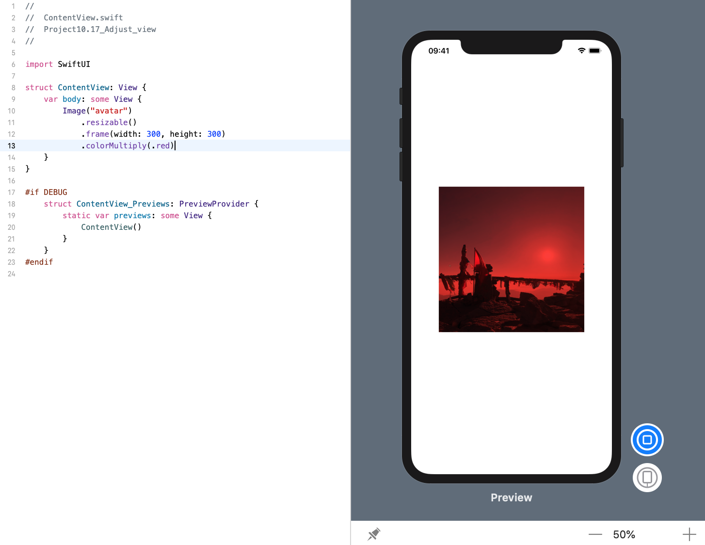
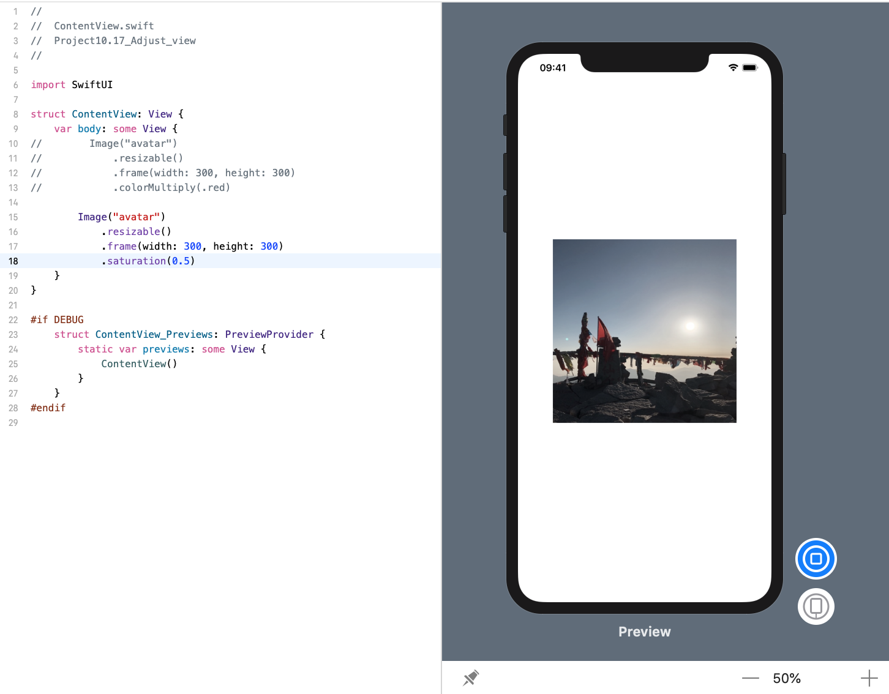
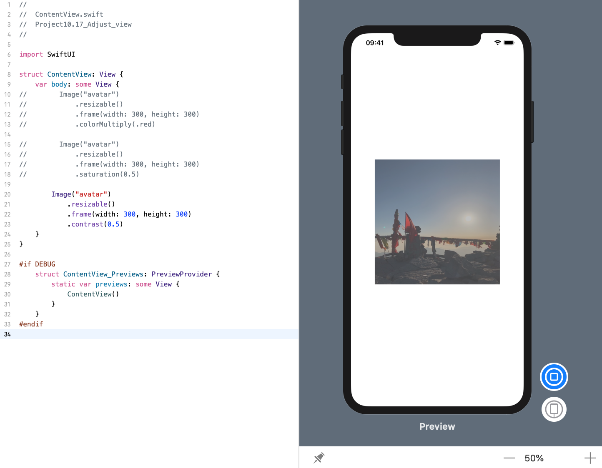

<!-- more -->
SwiftUI 允许我们通过使用各种修改器来调整视图的亮度、色调、色调、饱和度等等来精细地控制视图的外观。

### 1. 给图像视图着色
例如，下面代码会创建一个图像视图并将整个事物着色为红色:
```swift
struct ContentView: View {
    var body: some View {
        Image("avatar")
            .resizable()
            .frame(width: 300, height: 300)
            .colorMultiply(.red)
    }
}
```
效果预览:


### 2. 调整视图饱和度
我们可以将视图的饱和度调整为任意数量，其中0.0为完全灰色，1.0为其原始颜色:
```swift
struct ContentView: View {
    var body: some View {
        Image("avatar")
        .resizable()
        .frame(width: 300, height: 300)
            .saturation(0.5)
    }
}
```
效果预览:


### 3. 动态调整视图对比度
甚至可以使用 `contrast()` 修改器动态调整视图的对比度。如果值为0.0，则不会产生对比度（浅灰色图像），1.0将提供原始图像，高于1.0的所有内容都会添加对比度。
```swift
struct ContentView: View {
    var body: some View {
        Image("avatar")
        .resizable()
        .frame(width: 300, height: 300)
            .contrast(0.5)
    }
}
```
效果预览:
