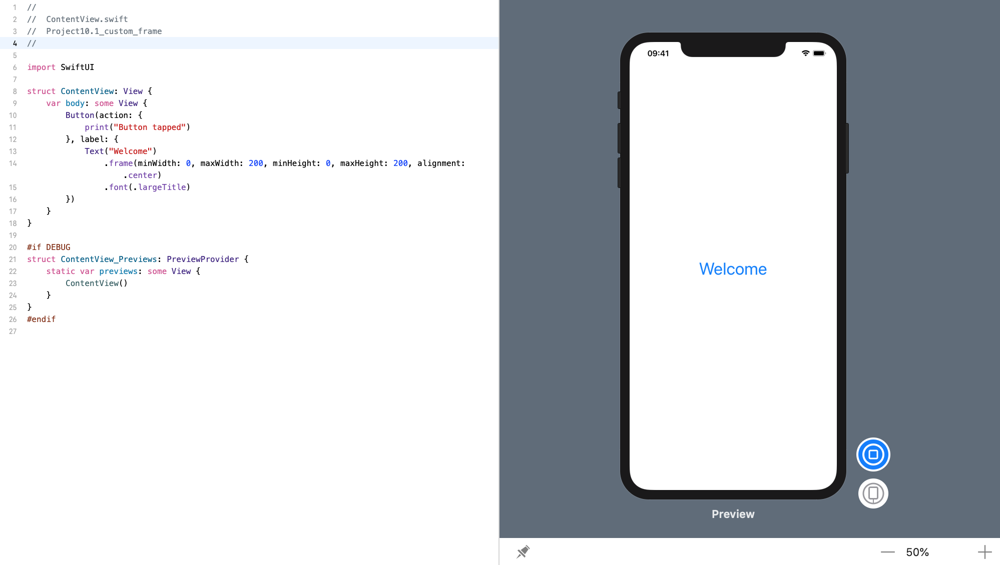
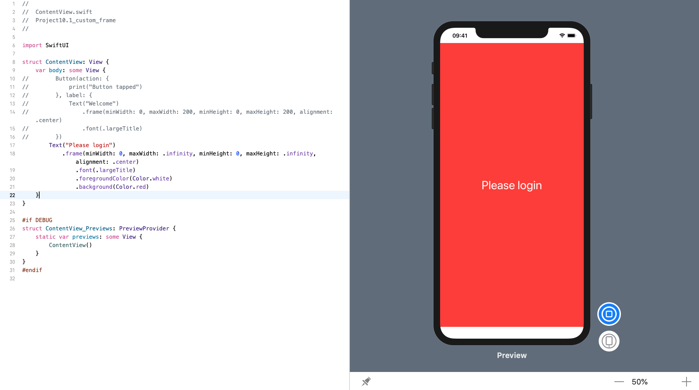

<!-- more -->
默认情况下，视图只占用自己所需的空间，但是如果我们想要更改它，可以使用 `frame()` 修饰符告诉 SwiftUI 我们想要的尺寸范围(size range)。

例如，可以创建一个具有 `200x200` 可点击区域的按钮，如下所示:
```swift
struct ContentView: View {
    var body: some View {
        Button(action: {
            print("Button tapped")
        }, label: {
            Text("Welcome")
                .frame(minWidth: 0, maxWidth: 200, minHeight: 0, maxHeight: 200, alignment: .center)
                .font(.largeTitle)
        })
    }
}
```
效果预览:

或者，我们可以通过指定一个 frame 来使文本视图填充整个屏幕，这个 frame 的最小宽度和最小高度为0，最大宽度和最大高度是无穷大。如下所示:
```swift
struct ContentView: View {
    var body: some View {
        Text("Please login")
            .frame(minWidth: 0, maxWidth: .infinity, minHeight: 0, maxHeight: .infinity, alignment: .center)
                .font(.largeTitle)
                .foregroundColor(Color.white)
                .background(Color.red)
    }
}
```
效果预览:
