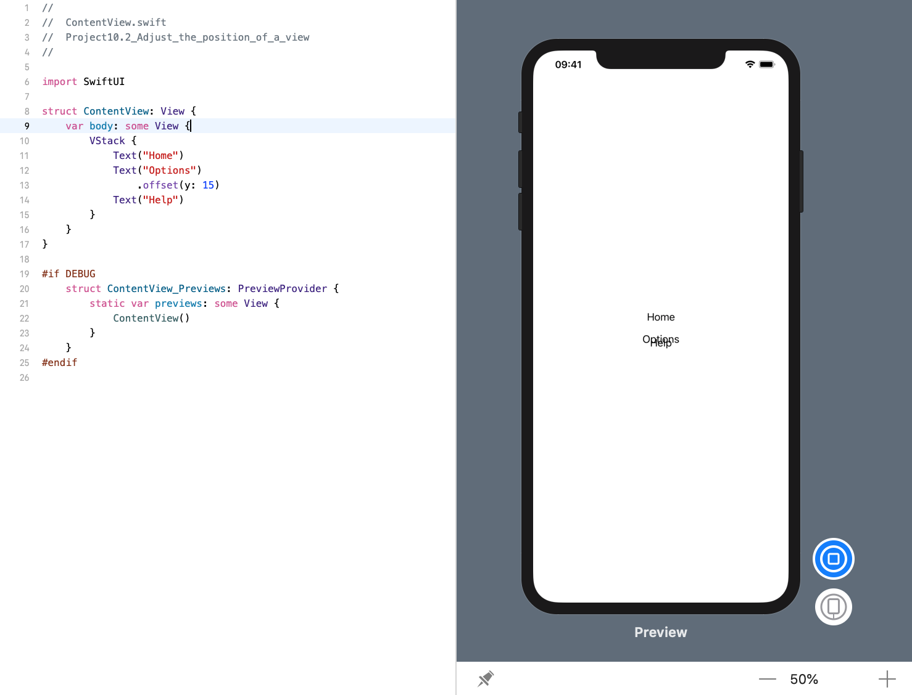
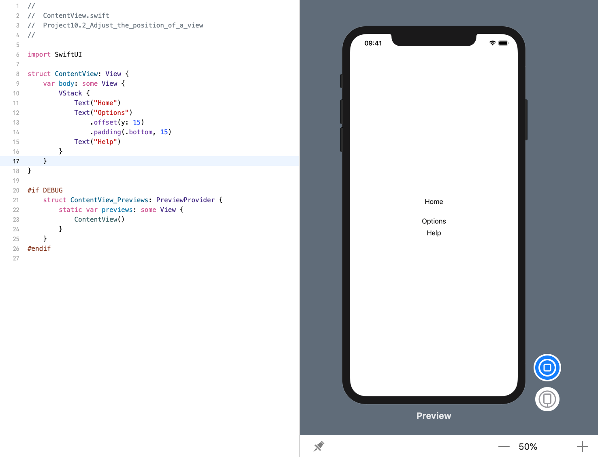

<!-- more -->
所有视图在层次结构中都有一个自然位置，但是我们可以通过 `offset()` 修改器相对于其自然位置来移动它们。

**重要说明:** 使用 `offset()` 将导致视图相对于其自然位置进行移动，但是不会影响其它视图的位置。这意味着我们可以使一个视图与另一个视图重叠，因为通常情况下它们可能彼此相邻，而这可能不是我们想要的。

例如，在这个 `VStack` 中，我们可以使用 `offset()` 将第二个项目向下移动15个点，以便它开始与第三个项目重叠: 
```swift
struct ContentView: View {
    var body: some View {
        VStack {
            Text("Home")
            Text("Options")
                .offset(y: 15)
            Text("Help")
        }
    }
}
```
效果预览:


通常，我们可以使用 `padding()` 和 `offset()` 来得到我们期望的结果，因为这样可以移动一个视图，同时挑着做那个它旁边的视图以使其匹配。

例如: 我们将第二个项目向下移动15个点，但在其底边添加15个填充点，使其不会与下面的文本视图重叠:
```swift
struct ContentView: View {
    var body: some View {
        VStack {
            Text("Home")
            Text("Options")
                .offset(y: 15)
                .padding(.bottom, 15)
            Text("Help")
        }
    }
}
```
效果预览:
