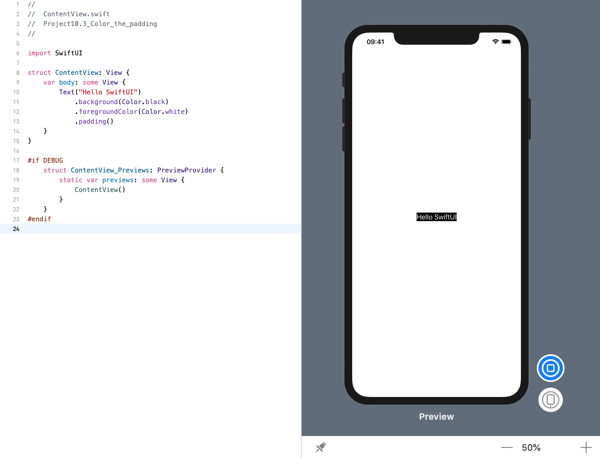
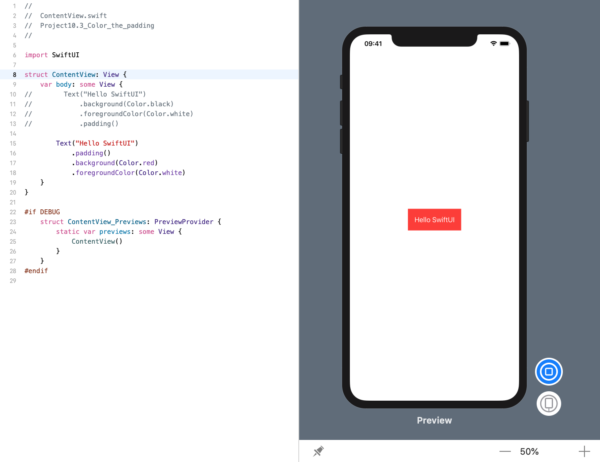

<!-- more -->
### 1. 简介
`padding()` 修饰符允许我们在视图周围添加一些空间，`background()` 修饰符允许我们设置背景颜色。 但是，我们使用它们的方式很重要，因此明确我们的目标以获得最佳结果非常重要。

### 2. 先着色后填充
例如，下面的代码将创建一个具有黑色背景和白色前景的文本视图，然后向其添加系统默认填充:
```swift
struct ContentView: View {
    var body: some View {
        Text("Hello SwiftUI")
            .background(Color.black)
            .foregroundColor(Color.white)
            .padding()
    }
}
```
效果预览:


### 3. 先填充后着色
例如，下面的代码将为文本视图添加系统默认填充，然后再为其设置红色背景和白色前景:
```swift
struct ContentView: View {
    var body: some View {
        Text("Hello SwiftUI")
            .padding()
            .background(Color.red)
            .foregroundColor(Color.white)
    }
}
```
效果预览:


### 4. 总结
这两段代码可能看起来很相似，但是它们会产生不同的结果，因为应用修饰符的顺序很重要。在第二个示例中，视图先被填充，然后被着色，这意味着填充也被着色为红色。与此相反，第一个示例是先着色，然后填充，因此填充保持未着色。

因此，如果我们希望某些文本的背景色比文本本身更宽，请确保使用第二个代码示例 – 先填充后着色。