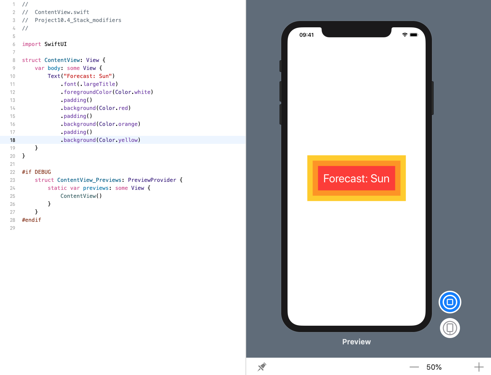

<!-- more -->
我们添加到视图中的每个修改器都会调整其前面的内容，并且可以多次重复使用修改器。

例如，我们可以在文本视图周围添加填充和背景色，然后添加更多的填充和不同的背景色，然后添加更多的填充和第三种背景色，所有这些都可以产生特定的效果:
```swift
struct ContentView: View {
    var body: some View {
        Text("Forecast: Sun")
            .font(.largeTitle)
            .foregroundColor(Color.white)
            .padding()
            .background(Color.red)
            .padding()
            .background(Color.orange)
            .padding()
            .background(Color.yellow)
    }
}
```
效果预览:
