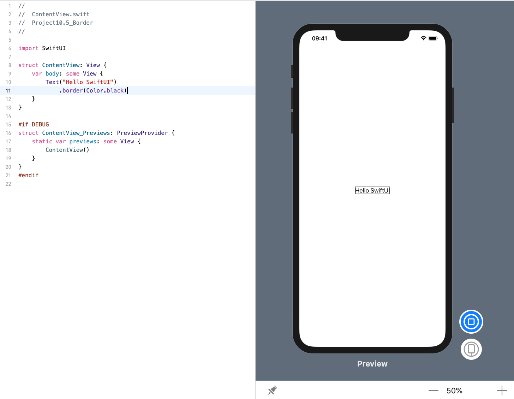
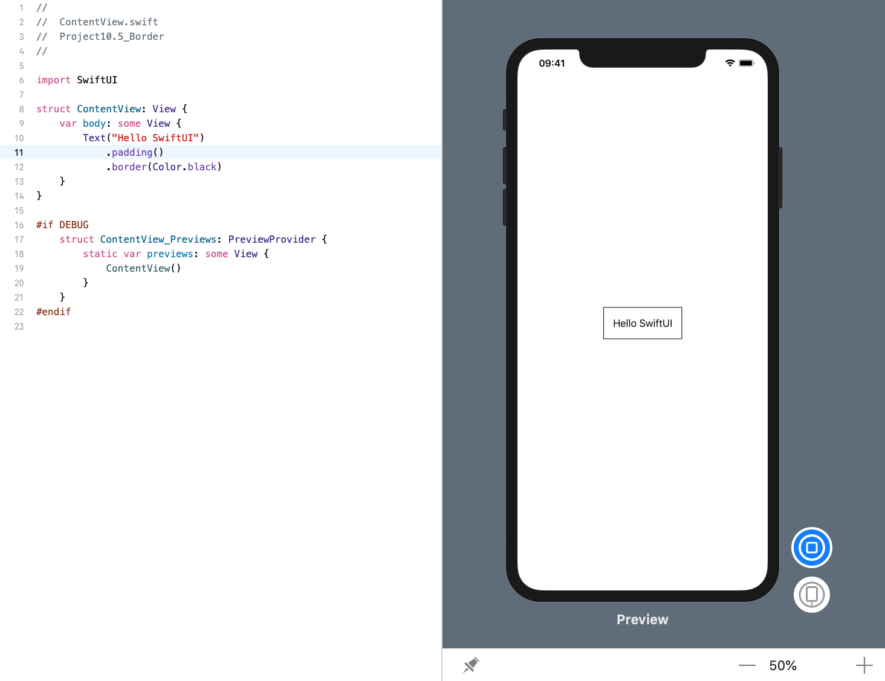
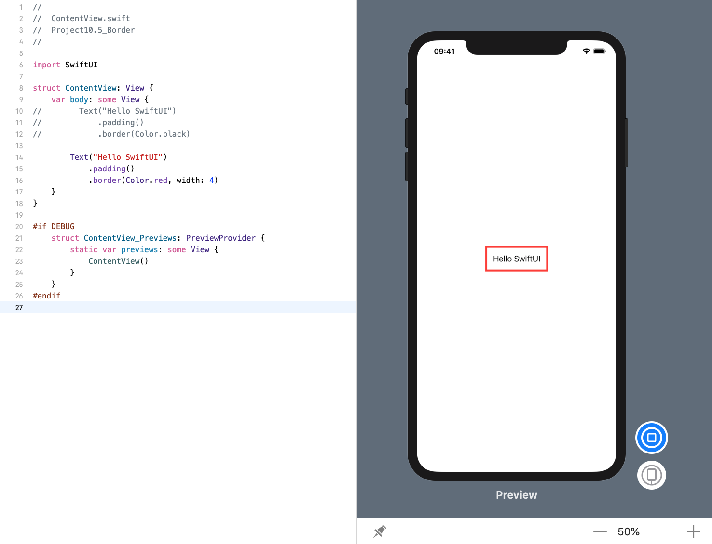

### 1. 简介
SwiftUI 为我们提供了一个专用的 `border` 修改器，用于在视图周围绘制边框。根据我们是要指定笔划宽度(a stroke width)还是圆角半径(a corner radius)，它有一些变化，因此下面是几个示例:

### 2. 绘制1个点的边框
下面的代码在文本视图周围绘制1个点的黑色边框:
```swift
struct ContentView: View {
    var body: some View {
        Text("Hello SwiftUI")
            .border(Color.black)
    }
}
```
效果预览:


### 3. 先添加填充再绘制边框
如果要使边框不位于视图边缘，请先添加一些填充：
```swift
struct ContentView: View {
    var body: some View {
        Text("Hello SwiftUI")
            .padding()
            .border(Color.black)
    }
}
```
效果预览:


### 4. 添加4个点的红色边框
```swift
struct ContentView: View {
    var body: some View {
        Text("Hello SwiftUI")
            .padding()
            .border(Color.red, width: 4)
    }
}
```
效果预览:
