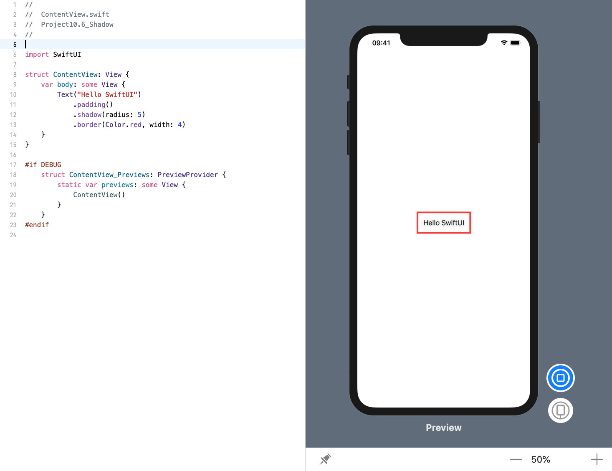
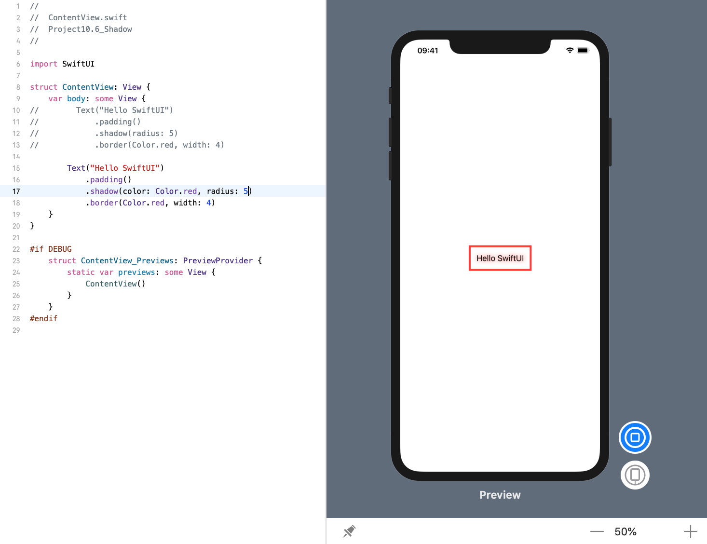
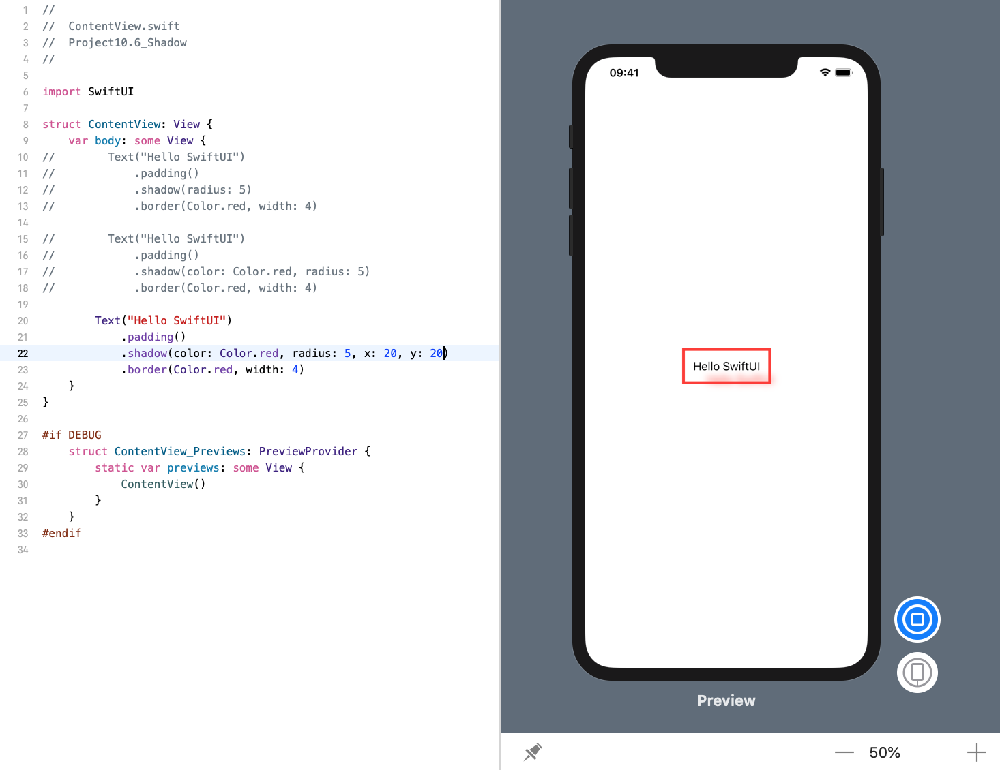
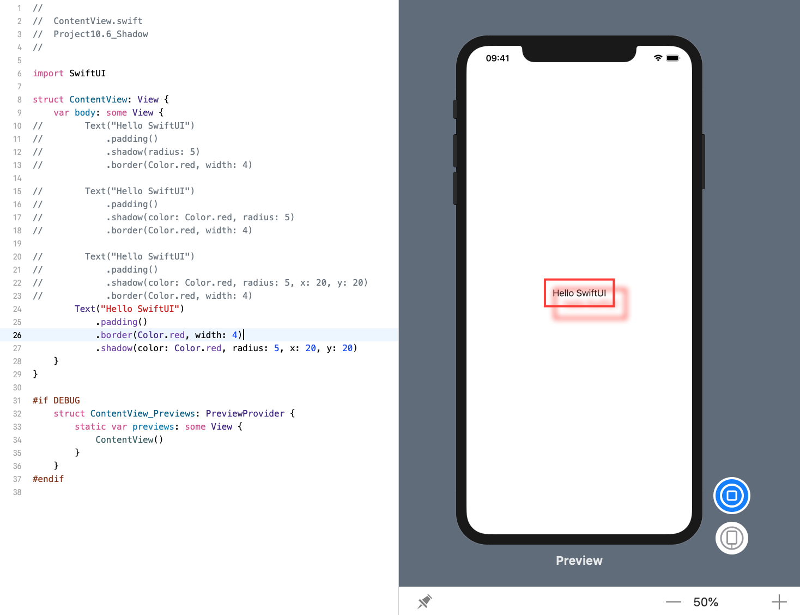

<!-- more -->
### 1. 简介
SwiftUI 为我们提供了一个专用的 `shadow()` 修改器，用于在视图周围绘制阴影。 我们可以控制阴影的颜色、半径和位置，还可以通过调整修改器顺序来控制视图的哪些部分被阴影遮盖。

### 2. 通过模糊半径绘制阴影
在其基本形式中，我们只需指定模糊的半径即可添加阴影，如下所示:
```swift
struct ContentView: View {
    var body: some View {
        Text("Hello SwiftUI")
            .padding()
            .shadow(radius: 5)
            .border(Color.red, width: 4)
    }
}
```
效果预览:

这段代码添加了一个非常轻微的阴影，以文本为中心的5点模糊。

### 3. 绘制红色阴影
我们还可以指定所需的颜色以及原始视图的X和Y偏移。 例如，下面的代码会创建一个强烈的红色阴影，其中包含5点模糊，以文本为中心：
```swift
struct ContentView: View {
    var body: some View {
        Text("Hello SwiftUI")
            .padding()
            .shadow(color: Color.red, radius: 5)
            .border(Color.red, width: 4)
    }
}
```
效果预览:


### 4. 为阴影设置偏移量
如果要为阴影指定偏移，请将 `x` 和/或 `y` 参数添加到修改器，如下所示:
```swift
struct ContentView: View {
    var body: some View {
        Text("Hello SwiftUI")
            .padding()
            .shadow(color: Color.red, radius: 5, x: 20, y: 20)
            .border(Color.red, width: 4)
    }
}
```
效果预览:


### 5. 为边框绘制阴影
请记住，SwiftUI 按照列出修改器的顺序来应用它们，因此如果我们希望可以将阴影应用于边框，只需将边框修改器放在阴影修改器之前:
```swift
struct ContentView: View {
    var body: some View {
        Text("Hello SwiftUI")
            .padding()
            .border(Color.red, width: 4)
            .shadow(color: Color.red, radius: 5, x: 20, y: 20)
    }
}
```
