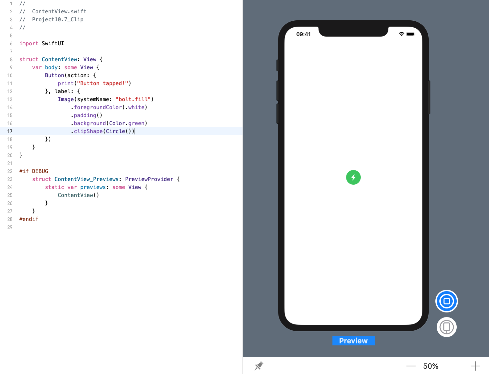
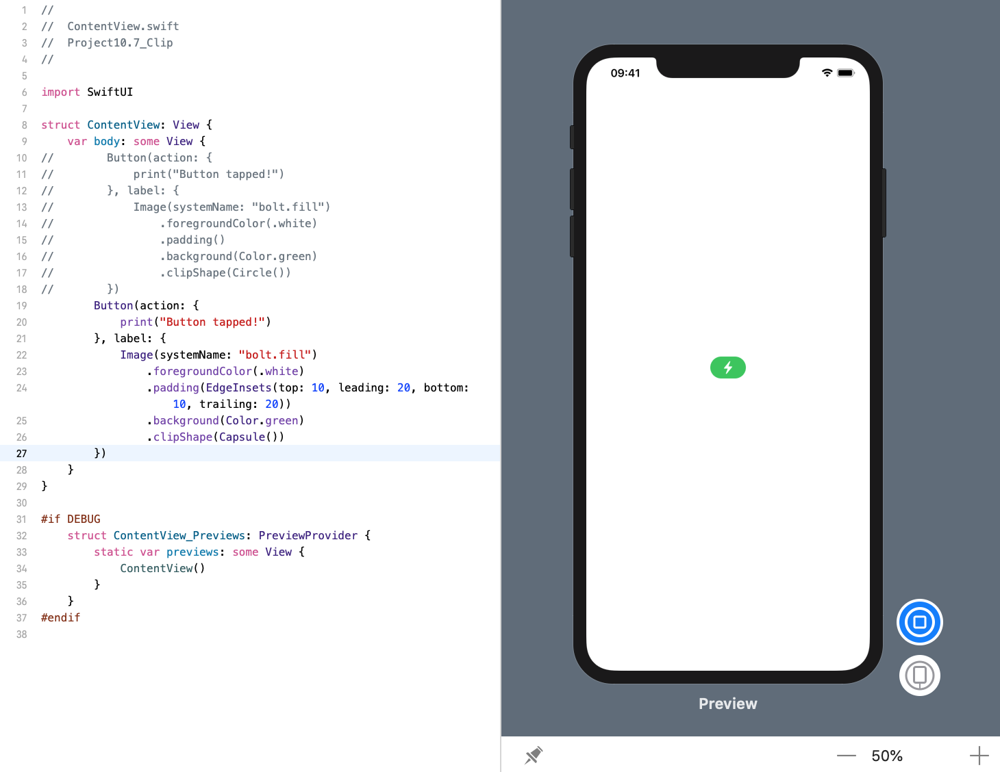

<!-- more -->
### 1. 初识
通过使用 `clipShape()` 修改器，SwiftUI允许我们剪切任何视图以控制其形状。

### 2. 创建圆形按钮
例如: 下面的代码使用系统图像 `bolt.fill` 创建一个按钮，给它一些填充和背景颜色，然后使用圆形剪裁它，以便我们得到一个圆形按钮:
```swift
struct ContentView: View {
    var body: some View {
        Button(action: {
            print("Button tapped!")
        }, label: {
            Image(systemName: "bolt.fill")
                .foregroundColor(.white)
                .padding()
                .background(Color.green)
                .clipShape(Circle())
        })
    }
}
```
效果预览:


`Circle` 剪辑形状将始终从视图中创建圆圈，即使它们的宽度和高度不相等 - 它只会裁剪较大的值以匹配较小的值。

### 3.
除了 `Circle` 之外，还有 `Capsule`，它可以看到圆形的菱形形状。 例如，下面的代码使用 `Capsule` 形状创建相同的按钮:
```swift
struct ContentView: View {
    var body: some View {
        Button(action: {
            print("Button tapped!")
        }, label: {
            Image(systemName: "bolt.fill")
                .foregroundColor(.white)
                .padding(EdgeInsets(top: 10, leading: 20, bottom: 10, trailing: 20))
                .background(Color.green)
                .clipShape(Capsule())
        })
    }
}
```
效果预览:
