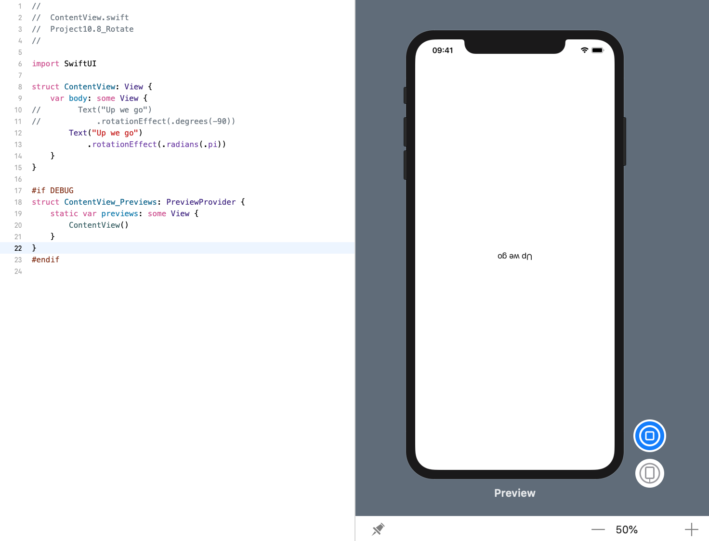
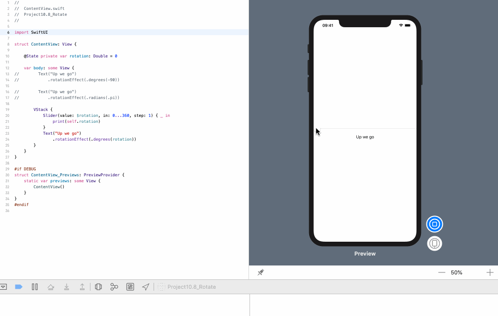
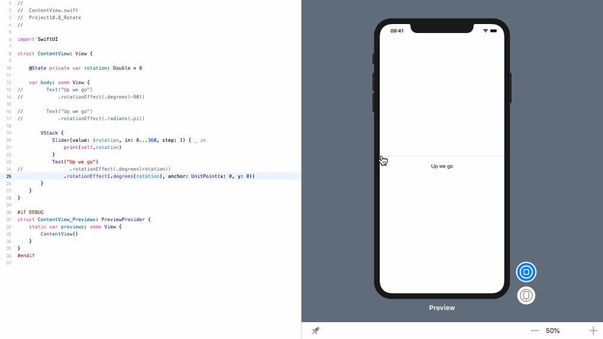

<!-- more -->
### 1. 初识
SwiftUI的 `rotationEffect()` 修改器让我们可以使用度数或弧度自由旋转视图。

### 2. 使用角度旋转视图
例如，如果我们想将某些文本旋转-90度以使其向上读取，我们可以使用：
```swift
struct ContentView: View {
    var body: some View {
        Text("Up we go")
            .rotationEffect(.degrees(-90))
    }
}
```
效果预览:


### 3. 使用弧度旋转视图
如果我们更喜欢使用弧度，只需传入 `.radians()` 作为参数，如下所示：
```swift
struct ContentView: View {
    var body: some View {
        Text("Up we go")
            .rotationEffect(.radians(.pi))
    }
}
```
效果预览:


### 4. 使用滑块交互
视图旋转速度如此之快，以至于实际上是自由的，所以如果需要，甚至可以使用滑块进行交互:
```swift
struct ContentView: View {
    
    @State private var rotation: Double = 0
    
    var body: some View {
        VStack {
            Slider(value: $rotation, in: 0...360, step: 1) { _ in
                print(self.rotation)
            }
            Text("Up we go")
                .rotationEffect(.degrees(rotation))
        }
    }
}
```
效果预览:


### 5. 设置旋转锚点
默认情况下，视图围绕其中心旋转，但如果要从特定点固定旋转，则可以为其添加额外参数。 例如，如果你想让旋转器围绕视图的左上角旋转旋转，你可以这样写：

默认情况下，视图围绕其中心旋转，但如果要从特定点固定旋转，可以为此添加一个额外参数。例如，如果要使上方的滑块围绕视图左上角旋转，可以编写以下命令:
```swift
struct ContentView: View {
    
    @State private var rotation: Double = 0
    
    var body: some View {
        VStack {
            Slider(value: $rotation, in: 0...360, step: 1) { _ in
                print(self.rotation)
            }
            Text("Up we go")
                .rotationEffect(.degrees(rotation), anchor: UnitPoint(x: 0, y: 0))
        }
    }
}
```
效果预览:
