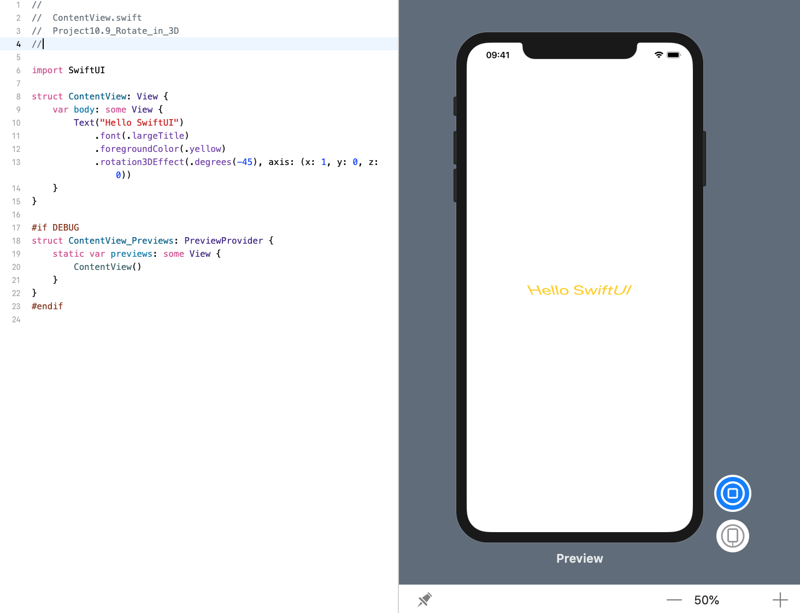

<!-- more -->
### 1. 初识
SwiftUI 的 `rotation3DEffect()` 修改器让我们可以在三维空间中旋转视图，几乎不需要任何代码就可以创建漂亮的效果。

这个修改器接受两个参数:

* 旋转的角度（以度或弧度为单位）。
* 加上包含X，Y和Z轴的元组，围绕该轴执行旋转。

**重要提示**: 如果你以前从未进行过三维旋转，那么你应该将X/Y/Z轴视为视图中的扦子。X轴是水平的，所以如果你在X轴上旋转，就像是在你的视图中放置一个水平的扦子 — 任何旋转都会使顶部或底部更近或更远，但不会调整前缘和后缘。

### 2. 围绕X轴旋转视图
因此，如果要围绕X轴将某些文本旋转45度（这将导致文本顶部比底部看得更远），可以编写以下命令:
```swift
struct ContentView: View {
    var body: some View {
        Text("Hello SwiftUI")
            .font(.largeTitle)
            .foregroundColor(.yellow)
            .rotation3DEffect(.degrees(-45), axis: (x: 1, y: 0, z: 0))
    }
}
```
效果预览:

