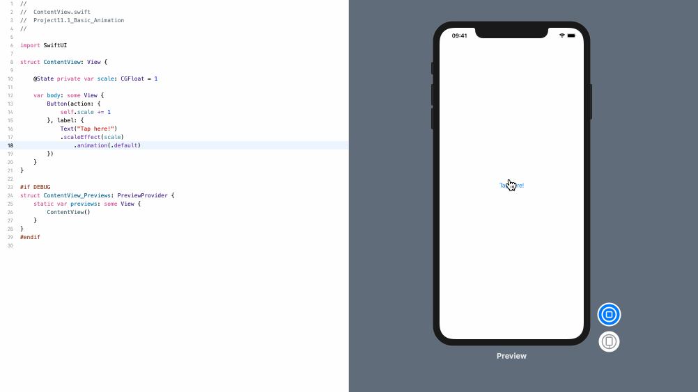
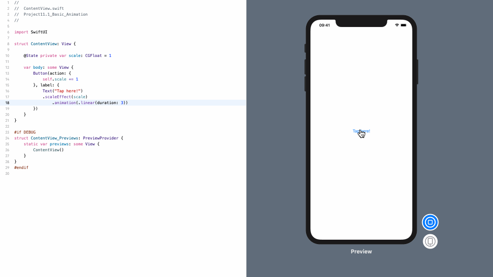
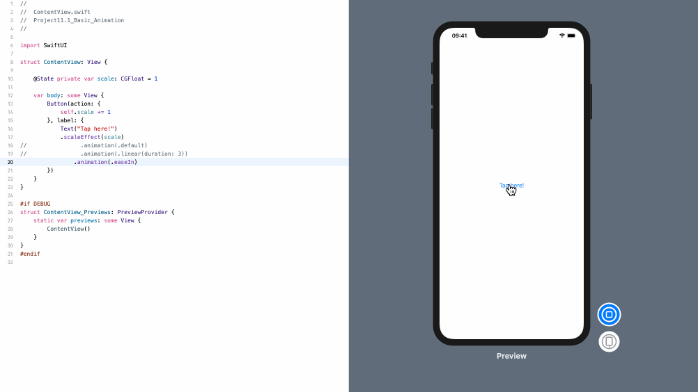
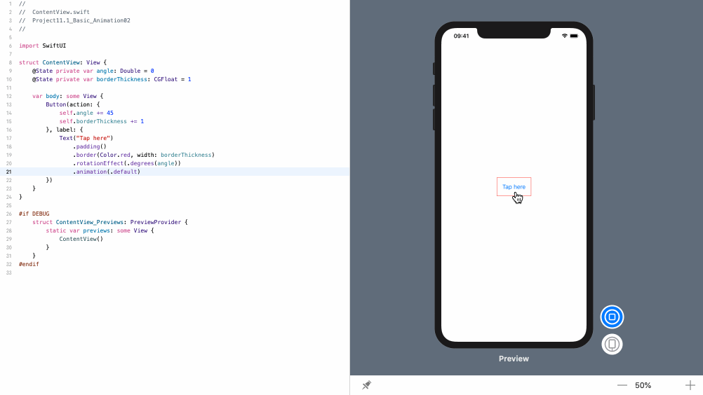

<!-- more -->
### 1. 初识
SwiftUI 通过其 `animation()` 修改器内置了对动画的支持。 要使用此修改器，请将其放在视图的任何其它修改器之后，并告诉它我们想要什么样的动画。

### 2. 缩放动画
例如，下面代码创建一个按钮，每次按下它时，其缩放效果会增加1:
```swift
struct ContentView: View {
    
    @State private var scale: CGFloat = 1
    
    var body: some View {
        Button(action: {
            self.scale += 1
        }, label: {
            Text("Tap here!")
            .scaleEffect(scale)
                .animation(.default)
        })
    }
}
```
效果预览:


### 2. 设置动画持续时间
如果需要，我们可以为动画指定精确的持续时间。 例如，下面代码会在三秒钟内激活缩放效果:
```swift
struct ContentView: View {
    
    @State private var scale: CGFloat = 1
    
    var body: some View {
        Button(action: {
            self.scale += 1
        }, label: {
            Text("Tap here!")
            .scaleEffect(scale)
                .animation(.linear(duration: 3))
        })
    }
}
```
效果预览:


### 3. 曲线动画
我们也可以指定曲线动画，在 `.easeIn`, `.easeOut`, `.easeInOut`, and `.custom` 之间进行选择，后者允许我们指定自己的控制点。

例如，下面代码会激活缩放效果，使其开始慢并逐渐变快:
```swift
struct ContentView: View {
    
    @State private var scale: CGFloat = 1
    
    var body: some View {
        Button(action: {
            self.scale += 1
        }, label: {
            Text("Tap here!")
            .scaleEffect(scale)
                .animation(.easeIn)
        })
    }
}
```
效果预览:


### 4. 设置多个动画变量
我们可以为许多其他修改器设置动画，例如2D和3D旋转，不透明度，边框等。 例如，下面代码会使按钮旋转并在每次点击时增加其边框:
```swift
struct ContentView: View {
    @State private var angle: Double = 0
    @State private var borderThickness: CGFloat = 1

    var body: some View {
        Button(action: {
            self.angle += 45
            self.borderThickness += 1
        }, label: {
            Text("Tap here")
                .padding()
                .border(Color.red, width: borderThickness)
                .rotationEffect(.degrees(angle))
                .animation(.default)
        })
    }
}
```
效果预览:
