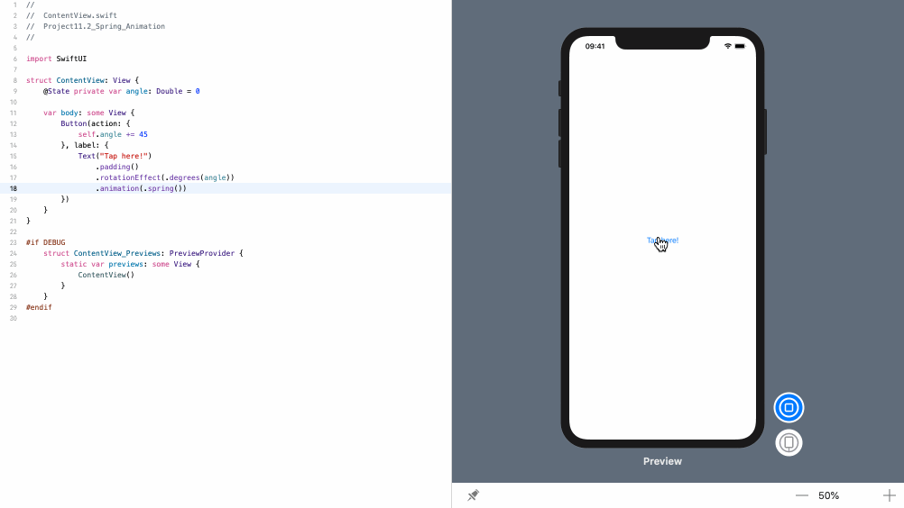
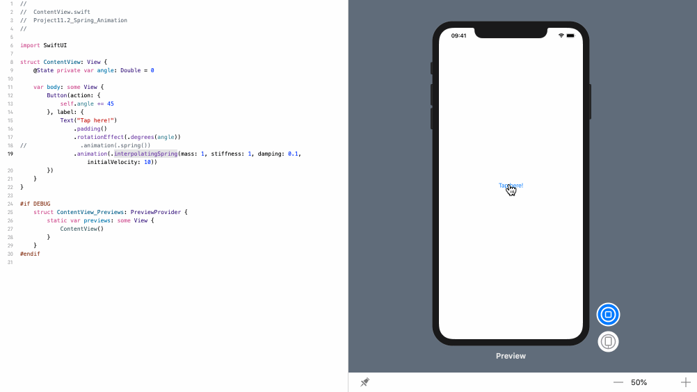

SwiftUI 内置了对弹性动画的支持，这些动画可以移动到目标点，越过一点，然后反弹。

### 1. 简单演示
如果只单独使用 `.spring()`，而没有参数，则会得到一个合理的默认值。因此，下面代码将创建一个弹性动画，每次点击按钮时，它将旋转45度:
```swift
struct ContentView: View {
    @State private var angle: Double = 0

    var body: some View {
        Button(action: {
            self.angle += 45
        }, label: {
            Text("Tap here!")
                .padding()
                .rotationEffect(.degrees(angle))
                .animation(.spring())
        })
    }
}
```
效果预览:


### 2. 细粒度控制弹性动画
如果我们想要对弹性动画进行细粒度的控制，可以发送任何我们感兴趣的参数: 对象的质量、弹簧的刚度、弹性减慢的速度以及它在启动时开始移动的速度。

例如，下面代码会创建一个弹性阻尼非常低的按钮，这意味着它会在达到目标角度之前长时间反弹:
```swift
struct ContentView: View {
    @State private var angle: Double = 0

    var body: some View {
        Button(action: {
            self.angle += 45
        }, label: {
            Text("Tap here!")
                .padding()
                .rotationEffect(.degrees(angle))
                .animation(.interpolatingSpring(mass: 1, stiffness: 1, damping: 0.1, initialVelocity: 10))
        })
    }
}
```
效果预览:
