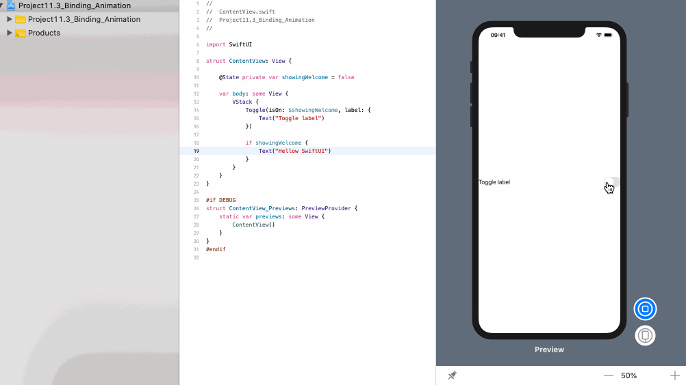
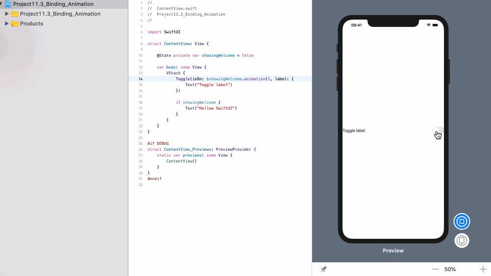
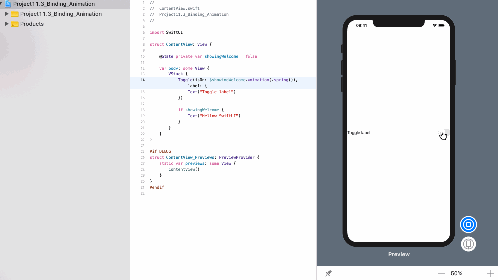

<!-- more -->
SwiftUI 的双向绑定让我们可以调整程序的状态，我们可以通过调整视图层次结构来响应它。 例如，我们可能会使某些文本显示或消失，或调整视图的不透明度。

我们可以通过向绑定添加 `animation()` 来对绑定进行修改而引起的更改进行动画处理，而不是立即进行状态更改。例如，此视图有一个切换按钮，根据切换的阶段显示或隐藏文本视图:
```swift
struct ContentView: View {
    
    @State private var showingWelcome = false
    
    var body: some View {
        VStack {
            Toggle(isOn: $showingWelcome, label: {
                Text("Toggle label")
            })
            
            if showingWelcome {
                Text("Hellow SwiftUI")
            }
        }
    }
}
```
效果预览:


如果没有动画，文本视图将立即显示或消失，从而导致视觉跳跃。 如果我们修改了 toggle
，那么它被绑定到 `$showingWelcome.animation()` ，那么文本视图将平滑滑入:
```swift
struct ContentView: View {
    
    @State private var showingWelcome = false
    
    var body: some View {
        VStack {
            Toggle(isOn: $showingWelcome.animation(), label: {
                Text("Toggle label")
            })
            
            if showingWelcome {
                Text("Hellow SwiftUI")
            }
        }
    }
}
```
效果预览:


如果希望对动画有更多的控制，可以将参数传递给影响转换方式的 `animation()`。例如，下面代码将使文本与弹簧动画一起出现:
```swift
```
效果预览:
