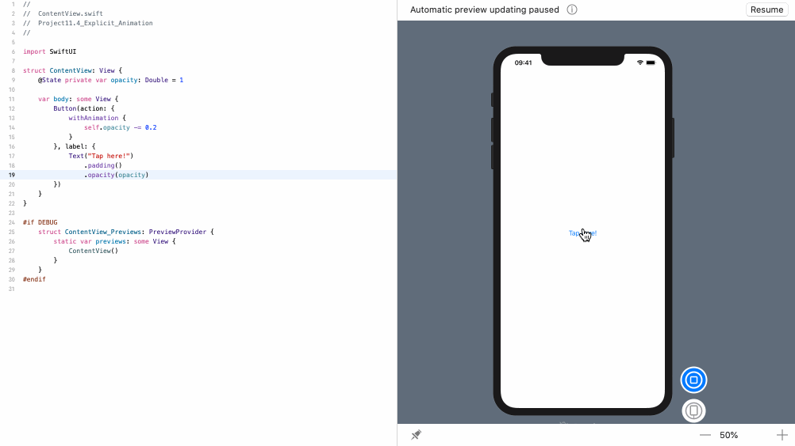

<!-- more -->
### 1. 简介
如果将动画修改器附加到一个视图上，最终会得到 `隐式动画` - 即使我们只是递增整数或切换布尔值，更改视图中其他位置的某些状态也可能会使用动画。

另一种方法是使用显式动画，在这种情况下，您不会将修改器附加到相关视图，而是要求SwiftUI为您要进行的精确更改设置动画。 为此，请在对 `withAnimation()` 的调用中包装更改。

### 2. 简单显式动画
例如，下面代码使用显式动画使每次点击时按钮逐渐消失:
```swift
struct ContentView: View {
    @State private var opacity: Double = 1

    var body: some View {
        Button(action: {
            withAnimation {
                self.opacity -= 0.2
            }
        }, label: {
            Text("Tap here!")
                .padding()
                .opacity(opacity)
        })
    }
}
```
效果预览:


### 3. 设置显式动画类型
`withAnimation()` 接收一个指定所需动画类型的参数，因此我们可以创建一个三秒钟的线性动画，如下所示:
```swift
struct ContentView: View {
    @State private var opacity: Double = 1

    var body: some View {
        Button(action: {
            withAnimation(.linear(duration: 3), {
                self.opacity -= 0.2
            })
        }, label: {
            Text("Tap here!")
                .padding()
                .opacity(opacity)
        })
    }
}
```
效果预览:
![11.4_explicit_animation_linear_opacity](img/11.4_explicit_animation_linear_opacity.gif "Set a explicit linear animation for opacity"

### 4. 总结
显式动画通常很有用，因为它们会使每个受影响的视图都出现动画，而不仅仅是那些附加了隐式动画的视图。 例如，如果视图A必须为视图B腾出空间作为动画的一部分，但只有视图B附加了动画，那么除非使用显式动画，否则视图A将跳转到其新位置而不进行动画处理。