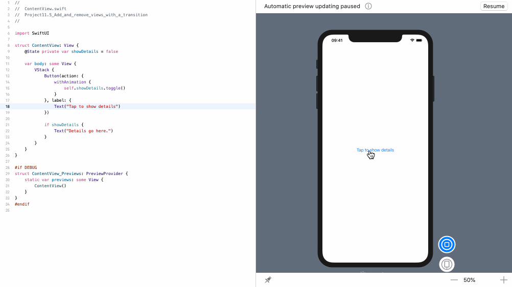
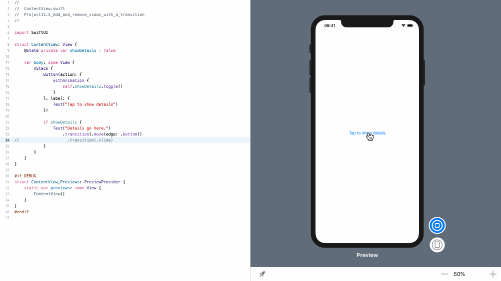

<!-- more -->
我们可以使用常规的 Swift 条件在设计中包含或排除某个视图。 

### 1. 默认动画 - fade
例如，当点击按钮时，这会添加或删除一些详细信息文本:
```swift
struct ContentView: View {
    @State private var showDetails = false

    var body: some View {
        VStack {
            Button(action: {
                withAnimation {
                    self.showDetails.toggle()
                }
            }, label: {
                Text("Tap to show details")
            })

            if showDetails {
                Text("Details go here.")
            }
        }
    }
}
```
效果预览:


### 2. 使用 transition 控制视图从底部滑入
默认情况下，SwiftUI 使用 `fade淡入淡出动画` 来插入或删除视图，但如果需要，可以通过将`transition()` 修改器附加到视图来更改它。
例如，我们可以将详细信息文本视图从底部滑入或滑出，如下所示:
```swift
struct ContentView: View {
    @State private var showDetails = false

    var body: some View {
        VStack {
            Button(action: {
                withAnimation {
                    self.showDetails.toggle()
                }
            }, label: {
                Text("Tap to show details")
            })

            if showDetails {
                Text("Details go here.")
                    .transition(.move(edge: .bottom))
            }
        }
    }
}
```
效果预览:


### 3. 使用 transaction(.slide)
还有 `.slide` 过渡，它导致视图从其前导中动画化并在其后缘上动画化:
```swift
struct ContentView: View {
    @State private var showDetails = false

    var body: some View {
        VStack {
            Button(action: {
                withAnimation {
                    self.showDetails.toggle()
                }
            }, label: {
                Text("Tap to show details")
            })

            if showDetails {
                Text("Details go here.")
                    .transition(.slide)
            }
        }
    }
}
```
效果预览:


### 4. 设置 transition(.scale)
以及 `.scale` 转换，它使视图在进入时从零缩放到全尺寸，然后在退出时返回到零：
```swift
struct ContentView: View {
    @State private var showDetails = false

    var body: some View {
        VStack {
            Button(action: {
                withAnimation {
                    self.showDetails.toggle()
                }
            }, label: {
                Text("Tap to show details")
            })

            if showDetails {
                Text("Details go here.")
                    .transition(.scale)
            }
        }
    }
}
```
效果预览:
