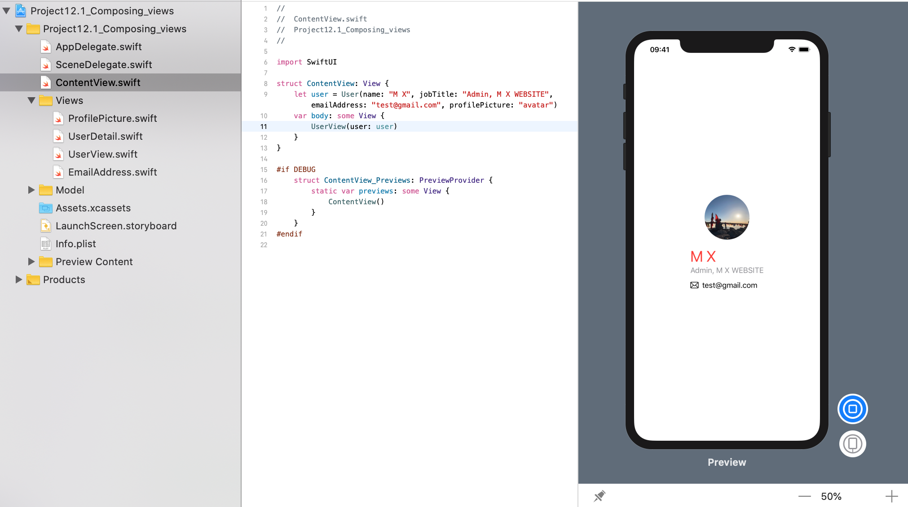

<!-- more -->
### 1. 简介
SwiftUI 的核心原则之一是组合，这意味着它是为我们设计的，可以创建许多小视图，然后将它们组合在一起以创建更大的视图。 这使得我们能够大规模地重用视图，这意味着我们的工作量减少了。 更好的是，组合小的子视图几乎没有运行时开销，因此我们可以自由地使用它们。

### 2. 实践
关键是要从小做起，逐步提升。 
#### 第1步: 定义 `User` 模型
例如，许多应用程序必须与看起来像这样的用户一起工作:
```swift
struct User {
    var name: String
    var jobTitle: String
    var emailAddress: String
    var profilePicture: String
}
```
#### 第2步: 定义 `ProfilePicture` 视图
如果我们希望在应用程序中为用户配置文件图片提供一致的设计，可以创建一个具有圆形的100x100图像视图:
```swift
struct ProfilePicture: View {
    var imageName: String

    var body: some View {
        Image(imageName)
            .resizable()
            .frame(width: 100, height: 100)
            .clipShape(Circle())
    }
}
```
#### 第3步: 定义 `EmailAddress` 视图
我们的设计师可能会告诉我们，只要看到电子邮件地址，我们就应该在其旁边显示一个小信封图标作为视觉提示，这样我们就可以创建一个 `EmailAddress` 视图:
```swift
struct EmailAdress: View {
    var address: String
    
    var body: some View {
        HStack {
            Image(systemName: "envelope")
            Text(address)
        }
    }
```
#### 第4步: 定义 `UserDetail` 视图
在显示用户的详细信息时，我们可以创建一个视图，该视图的名称和职务格式整齐，并使用我们的`EmailAddress` 视图通过其电子邮件地址进行备份，如下所示:
```swift
struct UserDetail: View {
    var user: User

    var body: some View {
        VStack(alignment: .leading) {
            Text(user.name)
                .font(.largeTitle)
                .foregroundColor(Color.red)
            Text(user.jobTitle)
                .foregroundColor(Color.gray)
            EmailAdress(address: user.emailAddress)
        }
    }
}
```

#### 第5步: 定义 `UserView` 视图
我们甚至可以创建一个更大的视图，将 `ProfilePicture` 放在 `UserDetail` 旁边，以便为用户提供单一的可视化表示，如下所示:
```swift
struct UserView: View {
    var user: User
    
    var body: some View {
        VStack {
            ProfilePicture(imageName: user.profilePicture)
            UserDetail(user: user)
        }
    }
}
```

#### 第6步: 组合
有了这种结构，我们现在有几种方式向用户展示：

* 只是他们的照片
* 只是他们的电邮地址
* 只是他们的工作细节
* 在同一时间展示所有信息

更重要的是，这意味着当涉及到使用所有这些工作时，我们的主要内容视图不必担心用户的外观或应如何对待它们 - 所有这些工作都融入到我们较小的视图中。

这意味着我们可以使用示例用户创建一个 `UserView` 并使其正常工作:
```swift
struct ContentView: View {
    let user = User(name: "M X", jobTitle: "Admin, M X WEBSITE", emailAddress: "test@gmail.com", profilePicture: "avatar")
    var body: some View {
        UserView(user: user)
    }
}
```
效果预览:
