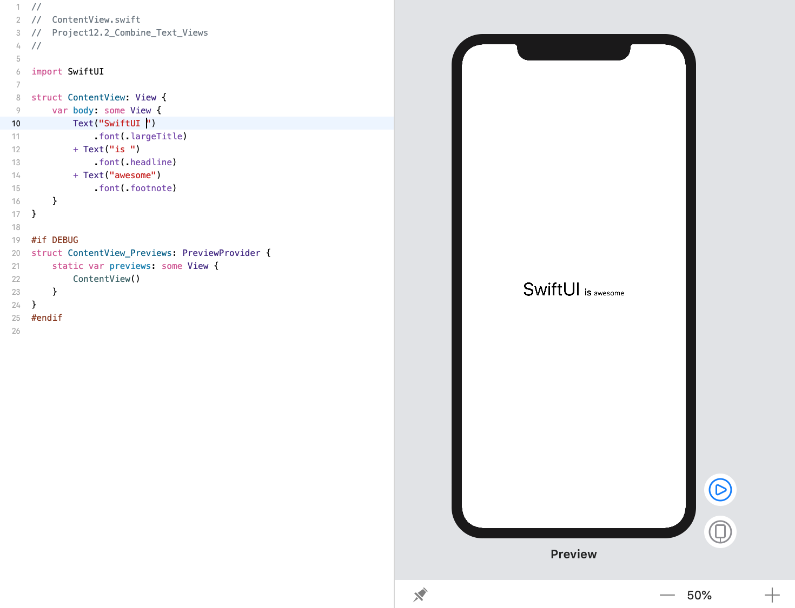
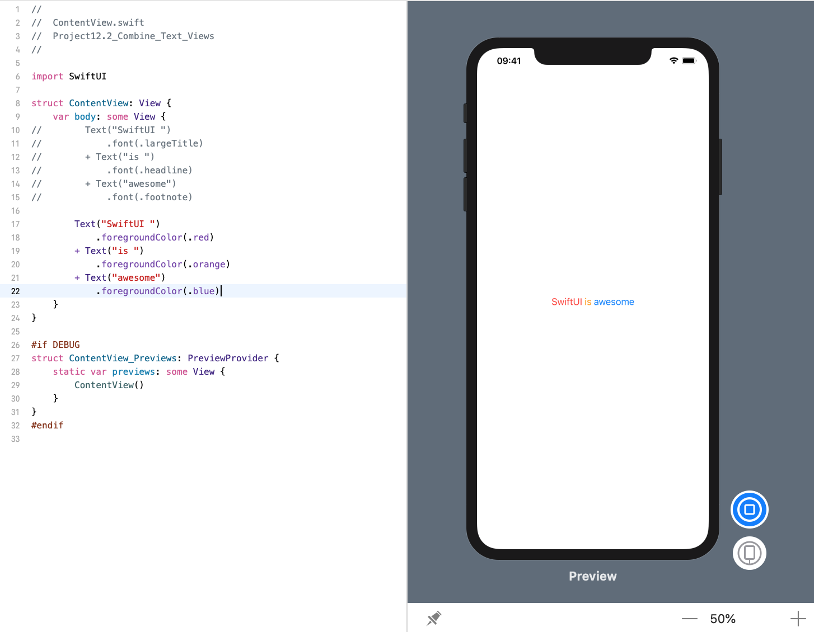

<!-- more -->
### 1. 简介
SwiftUI 的文本视图会重载 `+` 运算符，以便我们可以将它们组合在一起以创建新的文本视图。

当我们需要在视图中使用不同的格式时，这很有用，因为我们可以使每个文本视图看起来完全符合我们的要求，然后将它们连接在一起以创建单个组合文本视图。 更好的是，`VoiceOver` 在阅读它们时会自动将它们识别为单个文本。

### 2. 组合3个文本视图 - 不同字体
例如，下面代码会创建三个文本视图，然后使用 `+` 将它们连接到要返回的单个文本视图中:
```swift
struct ContentView: View {
    var body: some View {
        Text("SwiftUI")
            .font(.largeTitle)
        + Text("is ")
            .font(.headline)
        + Text("awesome")
            .font(.footnote)
    }
}
```
效果预览:


 
### 3. 组合3个文本视图 - 不同文本颜色
```swift
struct ContentView: View {
    var body: some View {
        Text("SwiftUI ")
            .foregroundColor(.red)
        + Text("is ")
            .foregroundColor(.orange)
        + Text("awesome")
            .foregroundColor(.blue)
    }
}
```
效果预览:


> **提示**: 像这样组合文本视图与我们在 SwiftUI 中组合字符串一样接近。