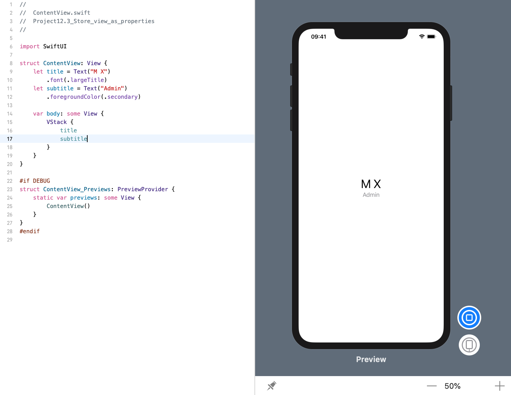

<!-- more -->
如果我们有多个嵌套在另一个视图中的视图，我们可能会发现为其中一些或全部视图创建属性非常有用，以使我们的布局代码更容易。 然后，我们可以在视图代码中内联引用这些属性，从而帮助保持代码的清晰。

例如，下面代码会创建两个文本视图作为属性，然后将它们放在VStack中:
```swift
struct ContentView: View {
    let title = Text("M X")
        .font(.largeTitle)
    let subtitle = Text("Admin")
        .foregroundColor(.secondary)
    
    var body: some View {
        VStack {
            title
            subtitle
        }
    }
}
```
效果预览:

如您所见，我们只需在堆栈中写入属性名称就足以放置它们。

但是，更好的是我们可以将修改器附加到这些属性名称，如下所示:
```swift
struct ContentView: View {
    let title = Text("M X")
        .font(.largeTitle)
    let subtitle = Text("Admin")
        .foregroundColor(.secondary)
    
    var body: some View {
        VStack {
            title
                .foregroundColor(.red)
            subtitle
        }
    }
}
```
效果预览:


这不会改变标题的基本风格，只会改变它的一个特定用法。