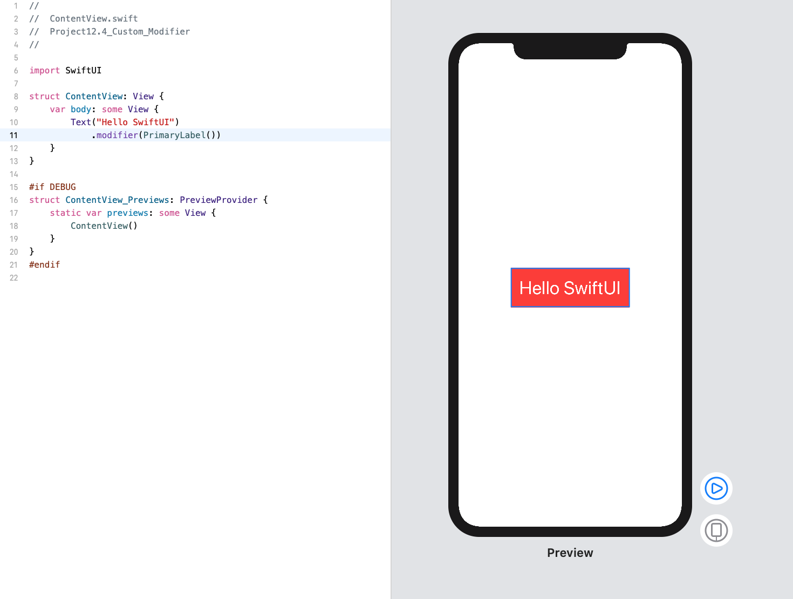

<!-- more -->
### 1. 简介
如果您发现自己不断地将同一组修改器附加到一个视图上（例如，给它一个背景色、一些填充、一个特定的字体等等），那么您可以通过创建一个封装所有这些更改的自定义视图修改器来避免重复。所以，与其说“让它变红，使用大字体”等等，你可以说“让它看起来像一个警告”，然后应用一组预先制作的修改器。

如果要创建自己的结构，请定义符合 `ViewModifier` 协议的结构。 此协议要求您接受 `body（content:)` 方法，该方法可以根据需要转换某种内容，并返回结果。

### 2. 实践
例如，我们将创建一个新的 `PrimaryLabel` 修改器，用于添加填充，红色背景，白色文本和大字体:
```swift
struct PrimaryLabel: ViewModifier {
    
    func body(content: Content) -> some View {
        content
            .padding()
            .background(Color.red)
            .foregroundColor(.white)
            .font(.largeTitle)
    }
}
```
要在我们的一个视图中使用它，请添加 `.modifier（PrimaryLabel())`修饰符，如下所示:
```swift
struct ContentView: View {
    var body: some View {
        Text("Hello SwiftUI")
            .modifier(PrimaryLabel())
    }
}
```
效果预览:
