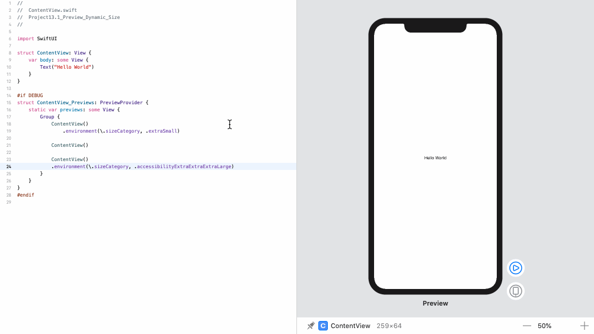

<!-- more -->
构建应用程序时，确保布局在所有动态类型范围内都能正常运行至关重要。 这部分是因为 SwiftUI 本身支持它，部分原因是许多人使用较小的字体大小，因为他们需要更高的信息密度，但主要是因为许多具有可访问性需求的人都依赖它。

幸运的是，SwiftUI 的所有组件本身都适应动态类型大小，通过在预览中使用 `\.sizeCategory` 环境值，可以轻松预览各种大小的设计。

例如，如果我们想要查看视图如何使用额外的小文本，我们可以将 `.environment（\.size Category，.extra Small)` 添加到内容视图预览中，如下所示:
```swift
#if DEBUG
struct ContentView_Previews: PreviewProvider {
    static var previews: some View {
        Group {
            ContentView()
                .environment(\.sizeCategory, .extraSmall)
        }
    }
}
#endif
```

我们还可以发回一组预览，所有预览都使用不同的大小类别。 这使我们可以并排查看各种字体大小的相同设计。

因此，此代码显示了超小尺寸，常规尺寸和最大尺寸的设计:
```swift
#if DEBUG
struct ContentView_Previews: PreviewProvider {
    static var previews: some View {
        Group {
            ContentView()
                .environment(\.sizeCategory, .extraSmall)
            
            ContentView()
            
            ContentView()
            .environment(\.sizeCategory, .accessibilityExtraExtraExtraLarge)
        }
    }
}
#endif
```
效果预览:


如果我们的设计在所有这三个方面都很有效，那么我们很高兴。

> 提示: 如果我们的预览已缩放，则应滚动或缩小到其他预览。