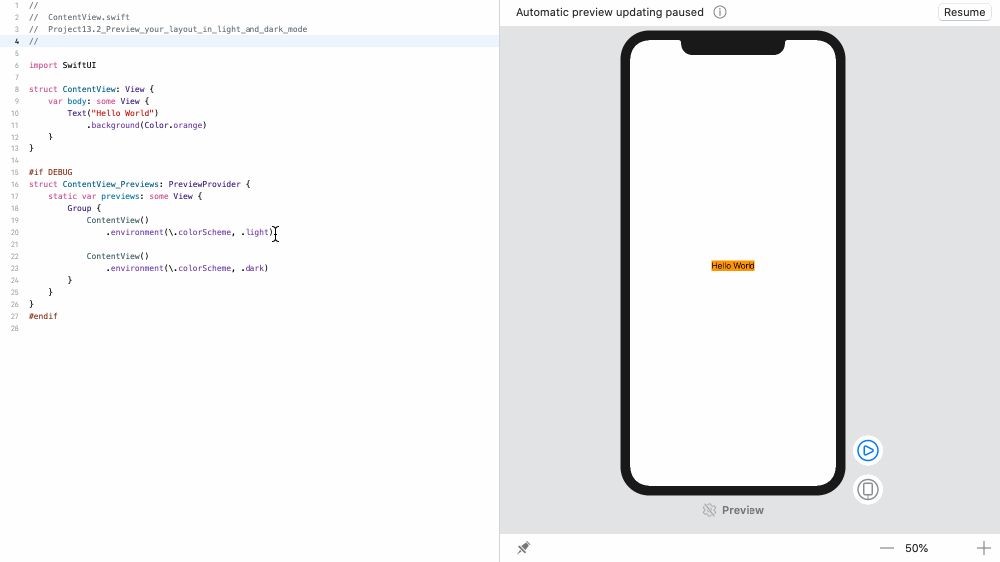

<!-- more -->
Apple的大多数操作系统都支持亮模式和暗模式用户界面，因此 SwiftUI 内置支持此功能也就不足为奇了。

更好的是，一旦我们设计了界面，Xcode 允许我们通过在预览中设置 `\.colorScheme` 环境值来以任一颜色方案预览布局。

例如，下面显示使用暗模式的预览:
```swift
#if DEBUG
struct ContentView_Previews : PreviewProvider {
   static var previews: some View {
      Group {
         ContentView()
            .environment(\.colorScheme, .dark)
      }
   }
}
#endif
```
如果我们要并排查看明暗模式，请在组中放置多个预览，如下所示:
```swift
#if DEBUG
struct ContentView_Previews: PreviewProvider {
    static var previews: some View {
        Group {
            ContentView()
                .environment(\.colorScheme, .light)
            
            ContentView()
                .environment(\.colorScheme, .dark)
        }
    }
}
#endif
```
效果预览:


> 提示: 如果我们的预览已缩放，则应滚动或缩小到其他预览。