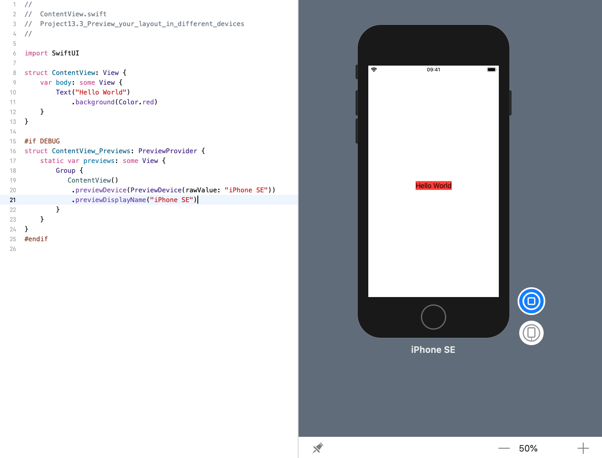

<!-- more -->
### 1. 简介
Xcode 的 SwiftUI 预览允许我们使用 `.previewDevice()` 修改器同时以多种屏幕尺寸显示我们的设计。 这需要提供设备的确切名称，如 Xcode 的目的地菜单中所示，例如， "iPhone XS Max"。

### 2. 在 iPhone SE 上预览
例如，下面代码显示了 iPhone SE上的预览:
```
struct ContentView: View {
    var body: some View {
        Text("Hello World")
            .background(Color.red)
    }
}

#if DEBUG
struct ContentView_Previews: PreviewProvider {
    static var previews: some View {
        Group {
           ContentView()
              .previewDevice(PreviewDevice(rawValue: "iPhone SE"))
        }
    }
}
#endif
```
效果预览:


### 3. 显示设备名称
使用特定设备进行预览时，我们可能会发现添加 `.previewDisplayName()` 修改器非常有用，它允许我们在预览窗口中的设备下添加名称。
```swift
struct ContentView: View {
    var body: some View {
        Text("Hello World")
            .background(Color.red)
    }
}

#if DEBUG
struct ContentView_Previews: PreviewProvider {
    static var previews: some View {
        Group {
           ContentView()
              .previewDevice(PreviewDevice(rawValue: "iPhone SE"))
              .previewDisplayName("iPhone SE")
        }
    }
}
#endif
```
效果预览:


### 4. 创建多个设备的预览
例如，下面代码会为两个不同的设备创建两个预览，添加每个设备的名称以明确发生了什么:
```swift
struct ContentView: View {
    var body: some View {
        Text("Hello World")
            .background(Color.red)
    }
}

#if DEBUG
struct ContentView_Previews: PreviewProvider {
    static var previews: some View {
        Group {
            ContentView()
                .previewDevice(PreviewDevice(rawValue: "iPhone SE"))
                .previewDisplayName("iPhone SE")
            ContentView()
                .previewDevice(PreviewDevice(rawValue: "iPhone XS Max"))
                .previewDisplayName("iPhone XS Max")
        }
    }
}
#endif
```
