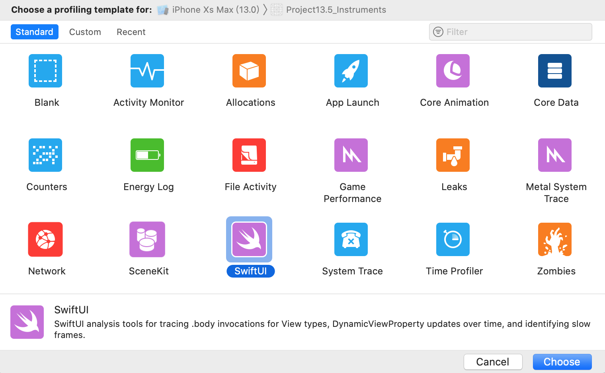
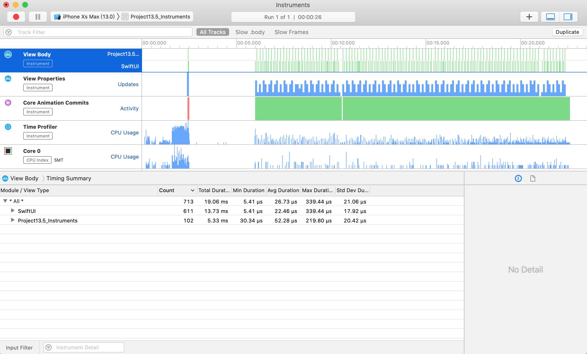
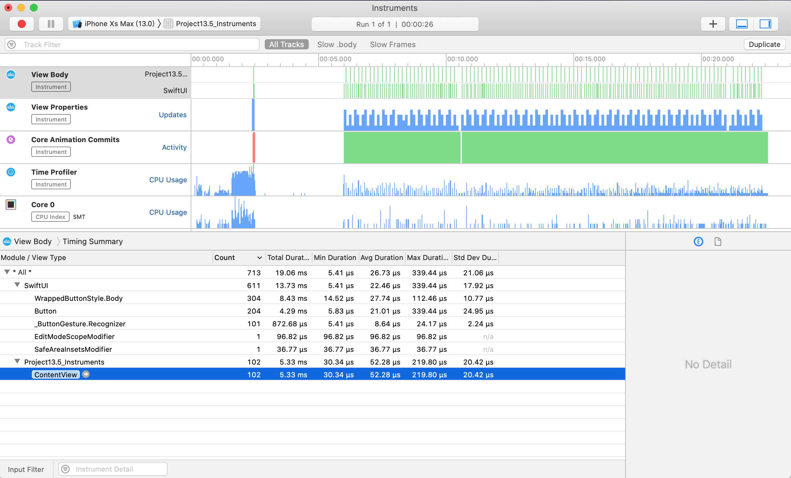
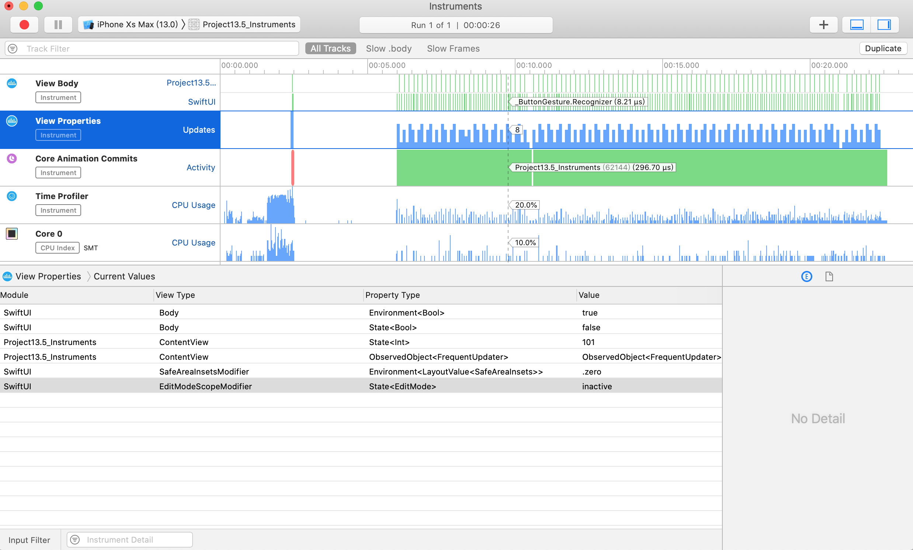
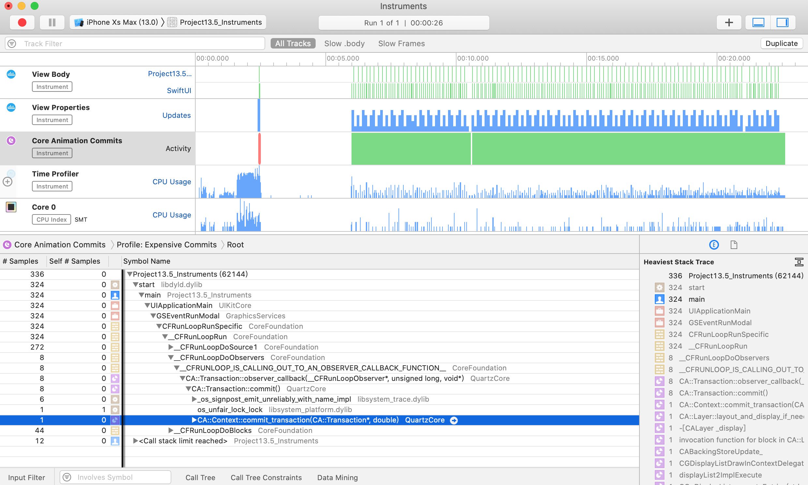
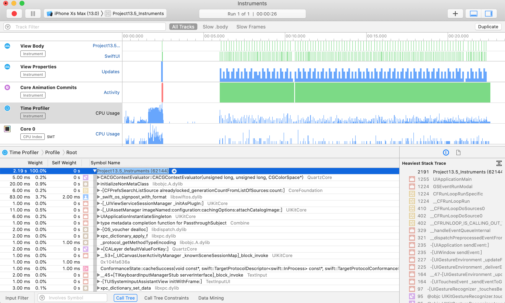

<!-- more -->
### 1. 简介
Xcode 的 `Instruments` 工具为 SwiftUI 提供了一套出色的分析功能，允许我们确定重新绘制视图的频率、计算视图主体的缓慢次数，甚至可以确定状态随时间的变化情况。

### 2. 准备工作
首先，我们需要一些能够提供我们在 `Instruments` 中可以看到的有趣结果的东西。所以，这段代码创建了一个计时器，它每隔0.01秒触发一次，并且有一个显示随机UUID的Body视图和一个按钮，每当点击它时会增加它显示的值:
```swift
import Combine
import SwiftUI

class FrequentUpdater: ObservableObject, Identifiable {
   var didChange = PassthroughSubject<Void, Never>()
   var timer: Timer?

   init() {
      timer = Timer.scheduledTimer(
         withTimeInterval: 0.01,
         repeats: true
      ) { _ in
         self.didChange.send(())
      }
   }
}

struct ContentView : View {
   @ObservedObject var updater = FrequentUpdater()
   @State var tapCount = 0

   var body: some View {
      VStack {
         Text("\(UUID().uuidString)")

         Button(action: {
            self.tapCount += 1
         }) {
            Text("Tap count: \(tapCount)")
         }
      }
   }
}
```
如果我们在模拟器中运行该代码，我们将看到它不断重绘，因为它的值始终在变化。

> **注意**: 这是一个专门设计的压力测试，旨在使 SwiftUI 做很多工作，以便 Instruments 向我们展示有趣的数据 - 我们不想在实际应用中使用上述代码。

### 3. 检测我们的代码
现在按 `Cmd + I` 通过 Instruments 运行代码，然后选择 SwiftUI instruments。 

出现时，按录制按钮使其启动应用程序并开始观看。 现在让它运行几秒钟，同时单击按钮十次左右，然后在仪器中按停止 - 我们有足够的数据可以使用。

默认情况下，SwiftUI仪器会告诉我们很多事情:

* 在这段时间内创建了多少个视图以及创建这些视图需要多长时间（"View Body"）。
* 视图的属性是什么以及它们随时间的变化（"View Properties"）。
* 发生了多少个核心动画提交（"Core Animation Commits"）。
* 每个函数调用所用的确切时间（"Time Profiler"）。

这些工具中的每一个都可以帮助我们诊断和解决 SwiftUI 应用程序中的性能问题，因此值得花时间尝试一下。

对于我们的小压力测试沙箱，您将看到 `View Body`，`View Properties` 和 `Core Animation Commits` 的纯色墙，这是一个直接的红旗。 它告诉我们，SwiftUI 不仅要不断重新创建我们的视图，而且我们的属性也在不断变化，因此 Core Animation 必须加班加点才能跟上。

效果预览:


### 4. 监控主题调用
如果我们选择 `View Body` 轨道 - 这是 instruments 列表中的第一行 - 我们应该能够看到 instruments 将结果分解为 `SwiftUI` 和 `我们的项目`，前者是原始类型，如文本视图和按钮，后者包含我们的自定义视图类型。 在我们的例子中，这意味着 "ContentView" 应该出现在自定义视图中，因为这是我们视图的名称。

现在，在这里我们将看不到一个完美的代码到 SwiftUI 视图的一对一映射，因为 SwiftUI 会积极地折叠其视图层次结构，以尽可能少地进行工作。所以，不要期望在代码中看到任何 `VStack` 创建——这对于这个应用程序来说是免费的。

在这个屏幕上，重要的数字是 `计数(Count)`和 `平均持续时间(Avg Duration)` - 每件事创建的次数，以及花费的时间。 因为这是一个压力测试我们应该看到非常高的数字，但我们的布局是微不足道的，所以平均持续时间可能是几十微秒。

效果预览:


### 5. 跟踪状态变化
接下来，选择 `View Properties` 轨道，这是 instruments 列表中的第二行。 这将显示所有视图的所有属性，包括其当前值和所有先前值。

我们的示例应用程序有一个按钮，通过在数字中给一个数字加1来更改其标签，并且在此工具中可见 - 请查看视图类型 ContentView 和 属性类型 `@State<Int>`。

遗憾的是，`Instruments` 还没有（还能）向我们展示那里的确切属性名称，如果你跟踪了几个整数状态，这可能会更加令人困惑。然而，它确实有一个不同的技巧：在记录窗口的顶部是一个标记当前视图位置的箭头，如果你拖动它，你会看到应用程序状态随时间的变化 - 每次你点击按钮，你会看到状态整数上升一个，你可以前进和后退来看它发生。

这可以解锁大量的功能，因为它可以让我们直接看到状态变化导致慢速重绘或其他工作 - 这几乎就像是在时间机器中，您可以在运行期间的每个点检查应用程序的确切状态。


### 6. 识别缓慢绘制
虽然 SwiftUI 能够直接下载到 Metal 以提高性能，但大多数情况下它更喜欢使用 `Core Animation` 进行渲染。 这意味着我们会自动从 Instruments 获取内置的 `Core Animation分析工具`，包括检测昂贵提交的能力。

当多个更改一起放入一个组（称为事务）时，Core Animation 的效果最佳。 我们在一个事务中有效地堆叠了一系列工作，然后要求CA继续渲染工作 - 称为提交事务。

因此，当 Instruments 向我们展示昂贵的 Core Animation 提交时，它真正向我们展示的是SwiftUI 因为更新而被迫重绘屏幕上的像素的次数。 理论上，这应该只在我们的应用程序的实际状态导致不同的视图层次结构时发生，因为 SwiftUI 应该能够将我们的 body 属性的新输出与先前的输出进行比较。


### 7. 查找缓慢的函数调用
最后一个重要的轨道是最后一个，`Time Profiler`，它向我们展示了在代码的每个部分花费了多少时间。 这与乐器中的常规时间分析器完全相同，但如果您之前没有尝试过，那么您至少需要知道：


* 右边的扩展细节窗口显示了默认情况下最重的堆栈跟踪，这是运行时间最长的一段代码。亮代码（白色或黑色，取决于您的MacOS颜色方案）是您编写的代码；暗代码（灰色）是系统库代码。
* 在左边，您可以看到所有创建的线程，以及让您深入到它们调用的函数和那些被调用的函数的公开指示器，等等。大部分工作将在“开始”中进行。
* 为了避免混乱，您可能需要单击底部的调用树按钮，然后选择隐藏系统库。这只会显示您编写的代码，但是如果您的问题是您使用的系统库不好，这可能没有帮助。
* 为了直接了解具体的细节，您还可以单击Call Tree并选择Invert Call Tree来翻转内容，这样叶子函数（位于树的末尾）就会显示在顶部，而披露指标现在可以让您向下钻取（向上钻取？）调用它们的函数。

虽然时间分析器对于识别性能问题非常有用，但通常仅查看最重的堆栈跟踪将突出显示最大的问题。




### 8. 最后的提示
在您收取配置自己的代码之前，有一些事情需要注意：

* 在检查应用程序性能的一小部分时，您应该单击并拖动相关范围，以便仅查看该应用程序部分的统计信息。这使您可以专注于特定操作的性能，例如响应按下按钮。
* 即使你在仪器中看到纯色条，它们只是从远处看起来那样 - 你可以通过按住 Cmd 并按 - 和+来查看更多细节
* 要获得最准确的数字，请始终在真实设备上进行配置。
* 如果要通过分析代码进行更改，请始终一次进行一项更改。如果你进行两次更改，可能会使你的性能提高20％而另一种会降低10％，但是将它们合在一起意味着你可能会认为它们整体性能提高了10％。
* Instruments 在发布模式下运行您的代码，从而实现 Swift 的所有优化。这也会影响您添加到代码中的任何调试标志，因此请小心。
