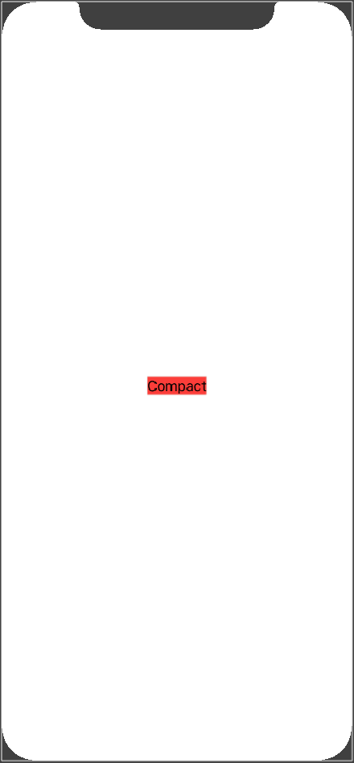
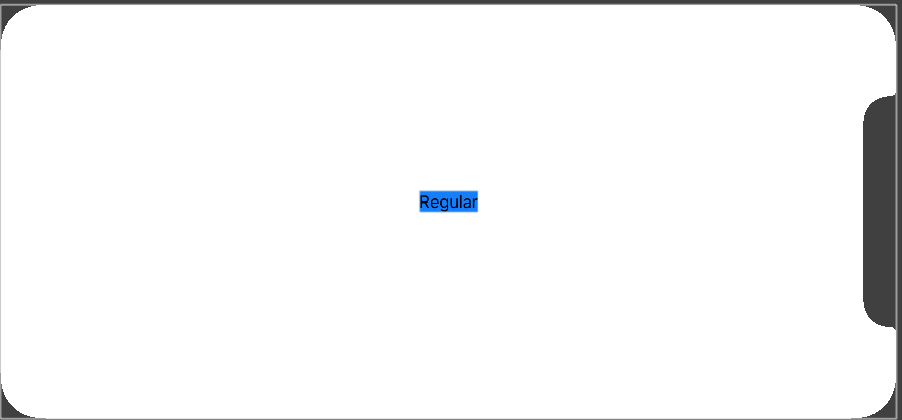

<!-- more -->
SwiftUI 通过在环境中暴露 _size classes_ 来原生支持它。如果要使用它，我们首先需要创建一个 `@Environment` 对象来存储其值，如下所示:
```swift
@Environment(\.horizontalSizeClass) var horizontalSizeClass
```
然后我们可以根据需要检查该属性的值，查找 `.compact` 或 `.regular`，如下所示:
```swift
if horizontalSizeClass == .compact {
    return Text("Compact")
} else {
    return Text("Regular")
}
```
将所有代码组合在一起，可以创建这样的视图:
```swift
struct ContentView: View {
    
    @Environment(\.horizontalSizeClass) var horizontalSizeClass
    
    var body: some View {
        if horizontalSizeClass == .compact {
            return Text("Compact")
        } else {
            return Text("Regular")
        }
    }
}
```
运行效果:

(1) 正向竖屏

(2) 横屏 - 刘海在右侧

(3) 横屏 - 刘海在左侧


SizeClass 是通过将 VStack 或 HStack 用于内容来使用户界面智能地适应可用空间的好方法。 例如，如果我们有很多空间，则可以水平放置东西，但在空间有限时切换到垂直布局。