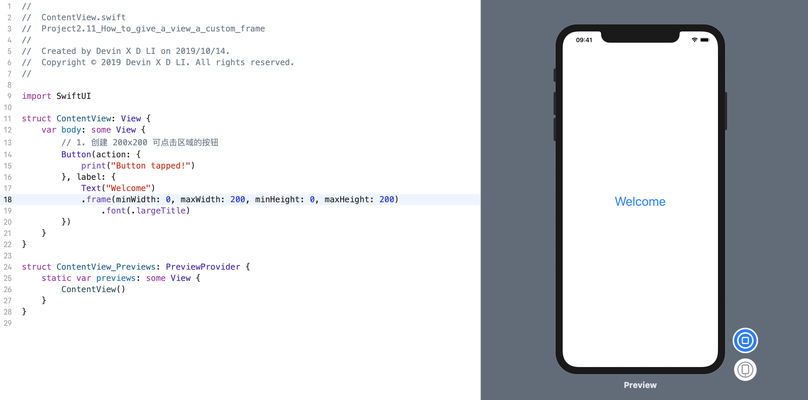
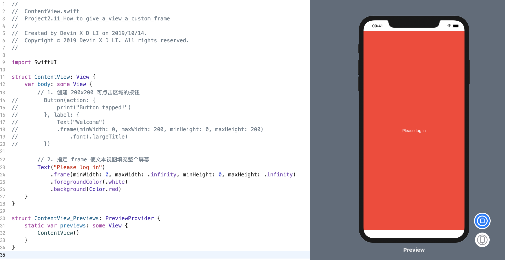
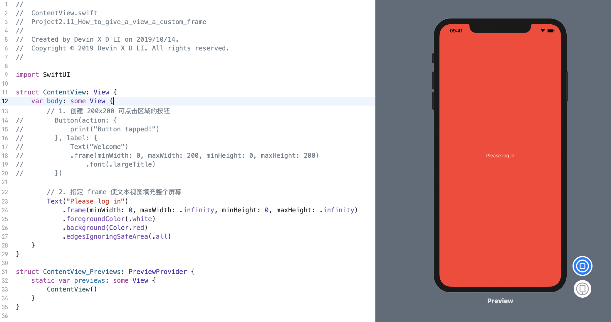

默认情况下，视图仅占用所需的空间，但是如果要更改视图，可以使用 `frame()` 修饰符告诉 SwiftUI 我们想要的大小范围。

### 1. 创建 200x200 可点击区域的按钮
例如，我们可以创建一个具有 200x200 可点击区域的按钮，如下所示:
```swift
struct ContentView: View {
    var body: some View {
        // 1. 创建 200x200 可点击区域的按钮
        Button(action: {
            print("Button tapped!")
        }, label: {
            Text("Welcome")
            .frame(minWidth: 0, maxWidth: 200, minHeight: 0, maxHeight: 200)
                .font(.largeTitle)
        })
    }
}
```
效果预览:


### 2. 指定 frame 使文本视图填充整个屏幕
我们可以通过指定一个框架来使文本视图填充整个屏幕（减去安全区域），该框架的最小宽度和高度为零，最大宽度和高度为无穷大，如下所示:
```swift
struct ContentView: View {
    var body: some View {
        // 2. 指定 frame 使文本视图填充整个屏幕
        Text("Please log in")
            .frame(minWidth: 0, maxWidth: .infinity, minHeight: 0, maxHeight: .infinity)
            .foregroundColor(.white)
            .background(Color.red)
    }
}
```
效果预览:


> 注意: 如果要使视图进入安全区域，请确保添加 `.edgesIgnoringSafeArea(.all)`修饰符。

效果预览:
