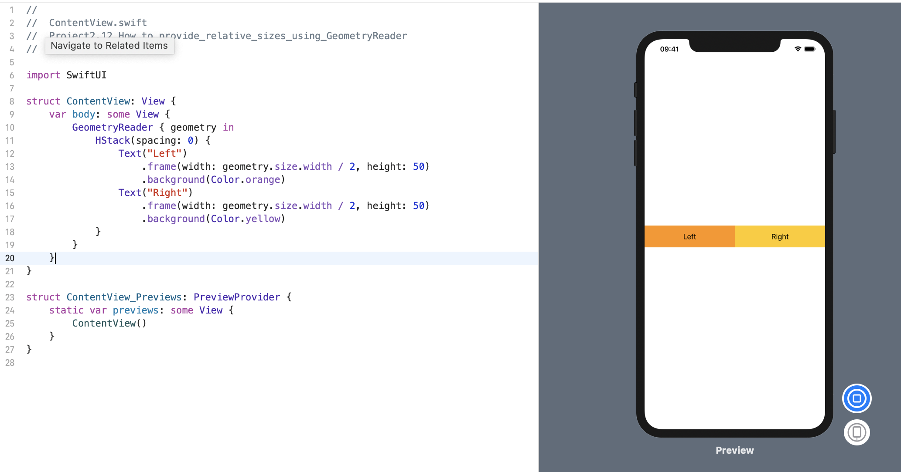

### 1. 简介
尽管通常最好让 SwiftUI 使用堆栈执行自动布局，但也可以使用 `GeometryReader` 提供相对于其容器的视图尺寸。 例如，如果我们希望两个视图占用屏幕上可用宽度的一半，则无法使用硬编码值，因为我们无法提前知道屏幕的宽度。

为了解决这个问题，`GeometryReader` 为我们提供了一个输入值，告诉我们可用的宽度和高度，然后我们可以在需要的任何计算中使用它。 因此，要使两个视图占据相等的宽度，我们可以将可用空间分成两半，如下所示:
```swift
struct ContentView: View {
    var body: some View {
        GeometryReader { geometry in
            HStack(spacing: 0) {
                Text("Left")
                    .frame(width: geometry.size.width / 2, height: 50)
                    .background(Color.orange)
                Text("Right")
                    .frame(width: geometry.size.width / 2, height: 50)
                    .background(Color.yellow)
            }
        }
    }
}
```
效果预览:


> 注意: GeometryReader 并未考虑视图层次结构中更下方的任何偏移量或间距，这就是为什么 HStack 上没有间距的原因–如果我们在其中允许间距，则视图对于可用空间会有点太大 。