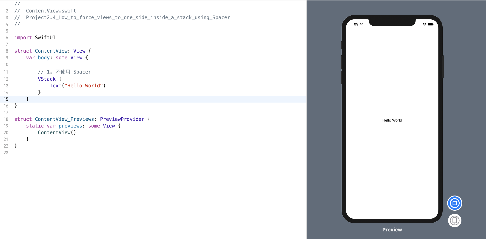
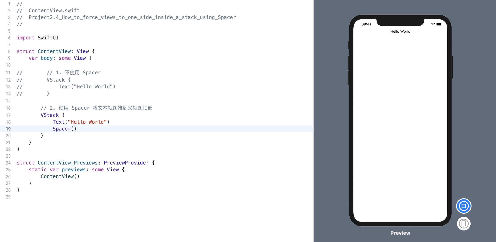
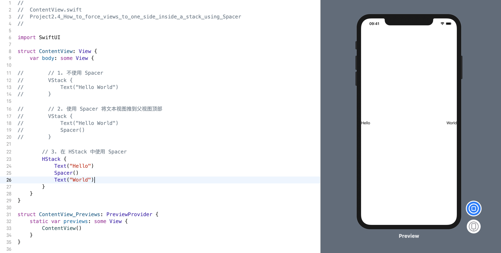
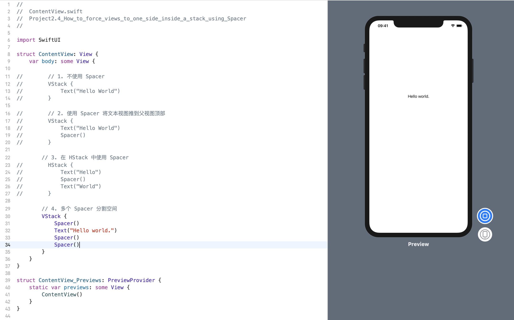

默认情况下，SwiftUI 会将其视图居中，这意味着: 如果将三个文本视图放在 VStack 中，则这三个文本视图将垂直居中显示在屏幕上。如果要更改此设置(如果要强制视图朝向屏幕的顶部/底部/左侧/右侧)，则应使用 `Spacer` 视图。

### 1. 不使用 Spacer
例如，我们将一个文本视图放置在 VStack 内，这意味着它将垂直居中:
```swift
struct ContentView: View {
    var body: some View {
        
        // 1. 不使用 Spacer
        VStack {
            Text("Hello World")
        }
    }
}
```
效果预览:


### 2. 将文本视图推到父视图的顶部
要将文本视图推到父视图的顶部，我们将在其下面放置一个 `Spacer` 视图，如下所示:
```swift
struct ContentView: View {
    var body: some View {
        // 2. 使用 Spacer 将文本视图推到父视图顶部
        VStack {
            Text("Hello World")
            Spacer()
        }
    }
}
```
效果预览:


### 3. 在 HStack 中使用 Spacer
如果我们希望在 HStack 的前后边缘上有两段文字，可以使用这样的分隔符:
```swift
struct ContentView: View {
    var body: some View {
        // 3. 在 HStack 中使用 Spacer
        HStack {
            Text("Hello")
            Spacer()
            Text("World")
        }
    }
}
```
效果预览:


### 4. 多个 Spacer 分割空间
`Spacer` 会自动分割所有剩余空间，这意味着如果您使用多个 Spacer，则可以按不同数量分割空间。

例如，这将通过在其上放置一个空格，在其后放置两个空格，将文本视图置于其父视图的三分之一以下：
```swift
struct ContentView: View {
    var body: some View {
        // 4. 多个 Spacer 分割空间
        VStack {
            Spacer()
            Text("Hello world.")
            Spacer()
            Spacer()
        }
    }
}
```
效果预览:


如果为 `Spacer` 提供一定范围的值，例如使用 `.frame（minHeight: 50,maxHeight:500）`，则它将自动占用尽可能多的空间，直到您设置的最大值。 以这种方式添加一些灵活性通常是一个好主意，这样我们的用户界面就可以更轻松地跨设备扩展。