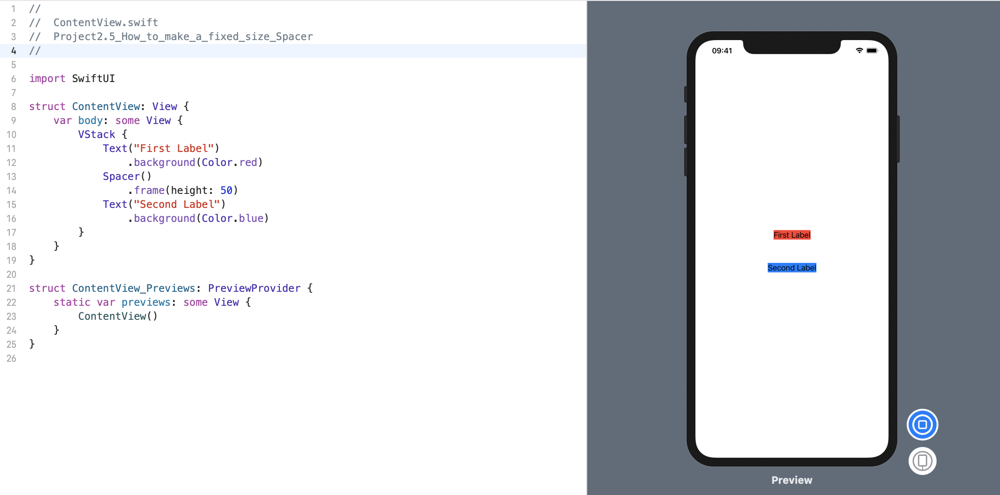

SwiftUI 的 `Spacer` 视图会自动填充其扩展轴上的所有可用空间，这是一种奇特的说法: 即根据我们所放置的内容，它们在水平或垂直方向上会占用尽可能多的空间。

如果要制作一个精确大小的 `Spacer`，则可以执行与其他视图相同的操作: 使用具有所需大小的 `frame()` 修饰符。

例如，这显示了两个文本视图，它们之间有一个50点的空格：
```swift
struct ContentView: View {
    var body: some View {
        VStack {
            Text("First Label")
                .background(Color.red)
            Spacer()
                .frame(height: 50)
            Text("Second Label")
                .background(Color.blue)
        }
    }
}
```
效果预览:
