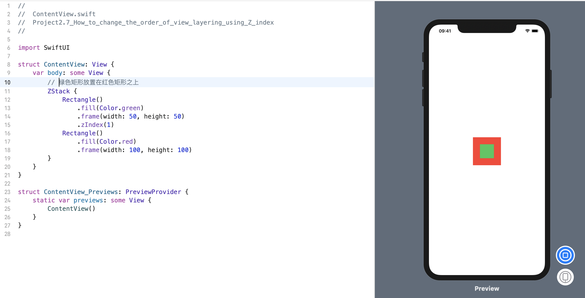

### 1. 前言
默认情况下，ZStack 使用 painter 的算法对其视图进行分层，以确定视图的深度: 首先放入 ZStack 中的内容会被首先绘制，然后在其上分层后续视图。

尽管这通常是我们想要的，但有时我们需要更多的控制权 - 例如，我们可能希望在应用运行时将一个视图推到另一个视图的后面，或者在点击某个视图时将其移到最前面。

要做到这一点，我们需要使用 `zIndex()` 修饰符，该修饰符允许我们精确地指定视图在单个 ZStack 中的分层方式。视图的默认z索引为0，但可以提供正值或负值，分别将它们放置在其他视图的上方或下方。

### 2. 示例: 绿色矩形放置在红色矩形之上
例如，此 ZStack 包含两个重叠的矩形，但是绿色矩形仍然可见，因为它使用的Z索引值为1:
```swift
struct ContentView: View {
    var body: some View {
        // 绿色矩形放置在红色矩形之上
        ZStack {
            Rectangle()
                .fill(Color.green)
                .frame(width: 50, height: 50)
                .zIndex(1)
            Rectangle()
                .fill(Color.red)
                .frame(width: 100, height: 100) 
        }
    }
}
```
效果预览:


> 注意: `zIndex()` 修饰符仅影响当前 ZStack 内的绘制顺序。 这意味着，如果我们有两个重叠的堆栈，则需要考虑堆栈的Z索引以及堆栈内部的视图。