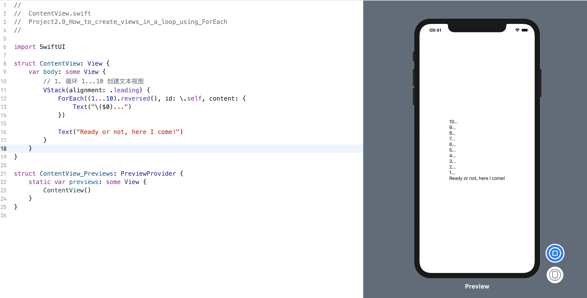
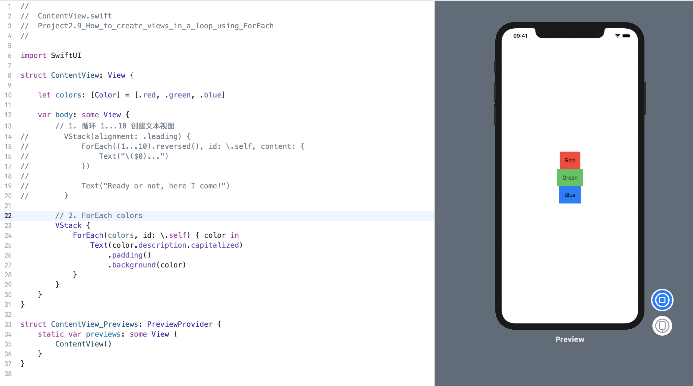
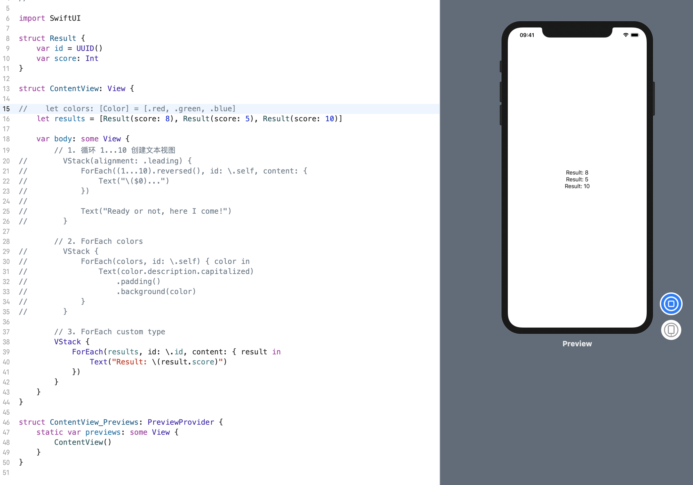

通常，我们会发现，我们需要遍历一个序列来创建视图，而在 SwiftUI 中，这是通过 `ForEach` 来完成的。

**重要提示**: 
我们很容易一看到 _ForEach_ 就认为它与 Swift 序列中的 _forEach()_ 方法相同，但事实并非如此。

* SwiftUI 中的 `ForEach` 本身是一个视图结构，这就意味着我们可以根据需要直接从视图 _Body_ 返回它。
* 我们为它提供一系列项目，可能还需要告诉 SwiftUI 它如何唯一地标识每个项目，以便 SwiftUI 知道如何在值更改时更新它们。
* 我们还传递一个要运行的闭包，来为循环中的每个项目创建一个视图。

对于范围内的简单循环，我们可以将范围直接传递到 ForEach 中，并告诉 Swift 将每个数字用作项目的唯一标识符。
### 1. 循环 1...10 创建文本视图
 例如，这从10减少到1，然后在最后添加一条消息：
```swift
struct ContentView: View {
    var body: some View {
        // 1. 循环 1...10 创建文本视图
        VStack(alignment: .leading) {
            ForEach((1...10).reversed(), id: \.self, content: {
                Text("\($0)...")
            })
            
            Text("Ready or not, here I come!")
        }
    }
}
```
效果预览:


`.id(: \.self)` 部分是必需的，这样 SwiftUI 可以唯一地标识数组中的每个元素——这意味着，如果添加或删除一个项，SwiftUI 可以确切地知道是哪一个。

### 2. ForEach colors
我们可以使用这种方法来创建任何类型的循环。 例如，此代码创建一个由三种颜色组成的数组，将它们全部循环，并使用每种颜色名称和颜色值创建文本视图:

```swift
struct ContentView: View {
    
    let colors: [Color] = [.red, .green, .blue]
    
    var body: some View {
        // 2. ForEach colors
        VStack {
            ForEach(colors, id: \.self) { color in
                Text(color.description.capitalized)
                    .padding()
                    .background(color)
            }
        }
    }
}
```
效果预览:


使用 `\.self` 告诉 Swift，每个项目都使用其自己的值进行唯一标识。 因此，如果我们有数组 [1、2、3] 并通过 `\.self` 标识每个值，则意味着第一项具有标识符1，第二个2 和 第三个3。

### 3. ForEach custom type
如果数组中有自定义类型，则应使用  `.id:` 类型内的任何属性对其进行唯一标识。
例如，这是一个存储测试结果的结构，如下所示：
```swift
struct Result {
    var id = UUID()
    var score: Int
}
```
它有一个带有 `UUID` 的 `id` 属性，这意味着它保证是唯一的 - 对于我们的目的而言是完美的。 如果我们要遍历结果数组，创建一个文本视图以显示 `VStack` 中每个结果，那么我们可以使用以下方法:
```swift
struct ContentView: View {

    let results = [Result(score: 8), Result(score: 5), Result(score: 10)]
    
    var body: some View {
        // 3. ForEach custom type
        VStack {
            ForEach(results, id: \.id, content: { result in
                Text("Result: \(result.score)")
            })
        }
    }
}
```
效果预览:

这告诉 SwiftUI 它可以通过查看它们的 `id` 属性来区分 `ForEach` 中的视图。

或者，如果使 Result 符合 `Identifiable` 协议，则只需编写 `ForEach(results)`。 遵守该协议意味着添加一个 id 属性，该属性唯一地标识每个对象，在我们的情况下，我们已经拥有了它。 因此，此代码实现了相同的结果：
```swift
struct Result: Identifiable {
    var id = UUID()
    var score: Int
}

struct ContentView: View {
    let results = [Result(score: 8), Result(score: 5), Result(score: 10)]

    var body: some View {
        VStack {
            ForEach(results) { result in
                Text("Result: \(result.score)")
            }
        }
    }
}
```
