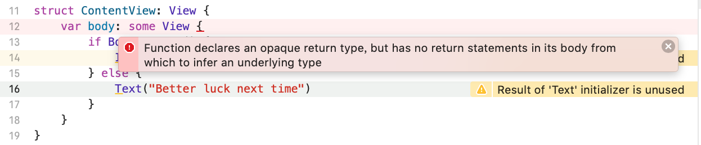

当我们从视图的 body 返回 `some View` 的时候，Swift 理解这意味着我们有一个特定的返回类型。

例如: 如果我们想掷硬币并显示 "你赢了!"，但是我们不能这样写: 要么返回一个 Image，要么返回一个 Text，写着 "下次祝你好运":
```swift
var body: some View {
    if Bool.random() {
        Image("example-image")
    } else {
        Text("Better luck next time")
    }
}
```
这段代码会报错:

因为它可能返回 _Image_ 或者 _Text_ ，这是不允许的 --  我们`必须精确返回一种类型`。
有两种方法可以解决这个问题。
### 1. Group
第一种方法是将输出包装在一个 `group` 中，这样无论我们发送图像视图还是文本视图，它们都将返回到一个 `group` 中:
```swift
var body: some View {
    Group {
        if Bool.random() {
            Image("example-image")
        } else {
            Text("Better luck next time")
        }
    }
}
```
运行效果:


### 2. AnyView
第二种方法，SwiftUI 提供了一个名为 `AnyView` 的类型，我们可以返回这种类型:
```swift
var body: AnyView {
    if Bool.random() {
        return AnyView(Image("example-image"))
    } else {
        return AnyView(Text("Better luck next time"))
    }
}
```
如果你还没有听说过这个概念，它会强制让 Swift 忘记 `AnyView` 中包含的特定类型，让它们看起来像是一样的东西。但这有性能成本，所以不要经常使用它。
尽管 `Group` 和 `AnyView` 都为我们的布局实现了相同的结果，但通常最好使用 `Group`，因为它对 SwiftUI 更有效。
