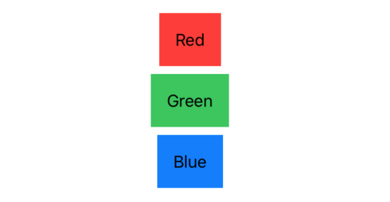
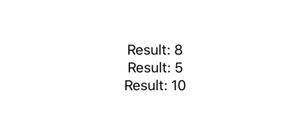

我们通常会发现，我们需要循环一个序列来创建视图，而在 SwiftUI 中，这是通过 `ForEach` 来完成的。

**重要提示**: 
我们很容易一看到 _ForEach_ 就认为它与 Swift 序列中的 _forEach()_ 方法相同，但事实并非如你所见。

* SwiftUI 中的 `ForEach` 本身是一个视图结构，这就意味着我们可以根据需要直接从视图 _Body_ 返回它。
* 我们为它提供一系列项目，可能还需要告诉 SwiftUI 它如何唯一地标识每个项目，以便 SwiftUI 知道如何在值更改时更新它们。
* 我们还传递一个要运行的闭包，来为循环中的每个项创建一个视图。
* 对于范围内的简单循环，您可以将范围直接传递给ForEach。

### 1. 循环 1...10 创建文本视图
 例如，这从10减少到1然后在最后添加一条消息：
```swift
var body: some View {
    VStack(alignment: .leading) {
        ForEach((1...10).reversed()) {
            Text("\($0)…")
        }
            
        Text("Ready or not, here I come!")
    }
}
```
运行效果:


### 2. ForEach colors
对于简单类型数组（如字符串、整数、颜色等）的循环，可以在数组上使用 `.identified(by: \.self)`，让 SwiftUI  使用值本身作为标识符。因此，如果您的数组是 `["cat", "Dog", "monkey"]`，那么 SwiftUI 会将这些字符串本身作为您的视图的标识符。
因此，此代码创建一个包含三种颜色的数组，在它们上面循环，并使用每个颜色名称和颜色值创建文本视图：

```swift
let colors: [Color] = [.red, .green, .blue]
    
var body: some View {
        
    VStack {
        ForEach(colors.identified(by: \.self)) { color in
            Text(color.description.capitalized)
                .padding()
                .background(color)
        }
    }
}
```
运行效果:


### 3. ForEach custom type
如果您的数组中有自定义类型，则应使用  `.identified(by:)` 与您的类型中的任何属性唯一标识它。
例如，这是一个存储测试结果的结构，如下所示：
```swift
struct Result {
    var id = UUID()
    var score: Int
}
```
它有一个带有 `UUID` 的 `id` 属性，这意味着它保证是唯一的 - 完美的用于我们的目的。 如果我们想循环一个结果数组，创建一个显示 `VStack` 中每个结果的文本视图，那么我们将使用它：
```swift
let results = [Result(score: 8), Result(score: 5), Result(score: 10)]
    
var body: some View {
    VStack {
        ForEach(results.identified(by: \.id)) { result in
            Text("Result: \(result.score)")
        }
    }
}
```
运行效果:

这告诉 SwiftUI 它可以通过查看它们的 `id` 属性来区分 `ForEach` 中的视图。
**提示**：如果您使 `Result` 符合 `Identifiable` protocol，您只需编写 `ForEach（Result）`。 符合此协议意味着添加唯一标识每个对象的 `id` 属性，在我们的示例中我们已经拥有，因此您只需编写 `struct Result：Identifiable {`！
