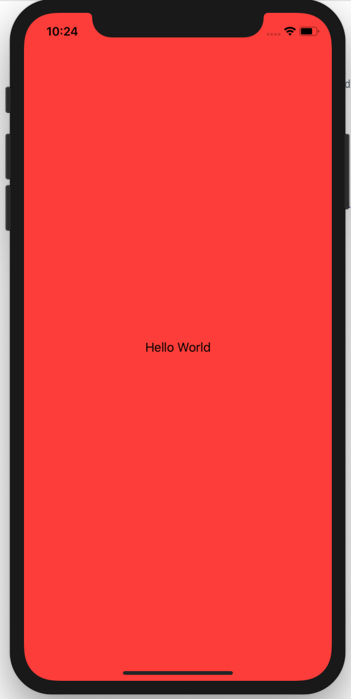

<!-- more -->
默认情况下，我们的 SwiftUI 视图将主要位于安全区域内 - 它将会到达屏幕底部，但不会靠近设备顶部的任何凹口。
如果我们想改变它 - 想让视图真正全屏，即使这意味着被一个缺口或其他硬件切口部分遮挡 - 那么我们应该使用 `edgesIgnoringSafeArea()` 修饰符。
例如，这会创建一个红色文本视图，要求填充所有可用空间，然后将其设置为忽略任何安全区域，以使其真正边缘到边缘。
```swift
var body: some View {
    Text("Hello World")
        .frame(minWidth: 0, maxWidth: .infinity, minHeight: 0, maxHeight: .infinity)    
        .background(Color.red)
        .edgesIgnoringSafeArea(.all)
}
```
运行效果:

