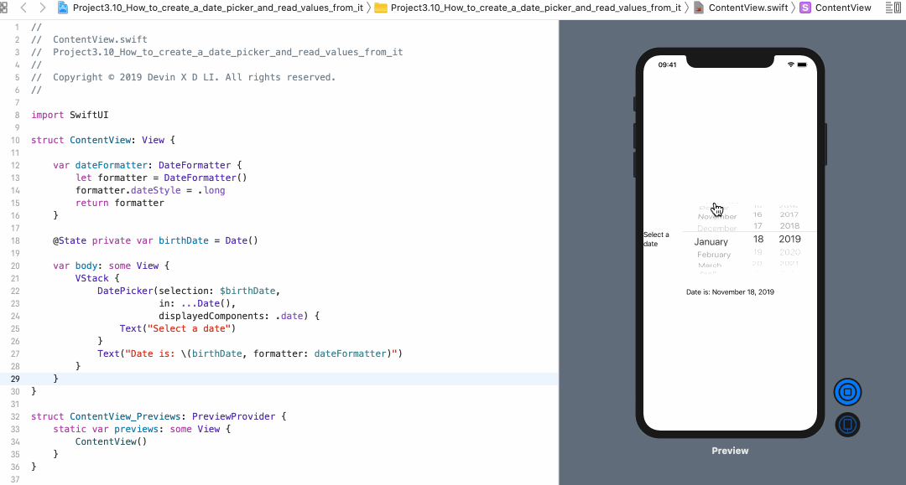

<!-- more -->
### 1. 初识
SwiftUI 中的 `DatePicker` 视图类似于 UIkit 中的 `UIDatePicker`，它提供了各种选项用来控制它的外观和工作方式。和所有存储值的控件一样，它也需要绑定到应用程序中的某种状态属性。

### 2. 示例
例如: 我们将创建一个日期选择器，并将其绑定到 `birthDate` 属性，允许用户选择现在之前的任何日期，然后按设置显示日期选择器的值，如下所示:
```swift
struct ContentView: View {
    
    var dateFormatter: DateFormatter {
        let formatter = DateFormatter()
        formatter.dateStyle = .long
        return formatter
    }
    
    @State private var birthDate = Date()
    
    var body: some View {
        VStack {
            DatePicker(selection: $birthDate,
                       in: ...Date(),
                       displayedComponents: .date) {
                Text("Select a date")
            }
            Text("Date is: \(birthDate, formatter: dateFormatter)")
        }
    }
}
```
效果预览:


可以看到我已经将 **DisplayedComponents** 设置为 `.Date`，但您也可以使用 `.hourAndMinute`来获取时间数据。

使用 `in：... Date()` 将日期范围指定为直到当前日期(包括当前日期)的所有内容，但不包含之后的任何内容。 
也可以使用 `in：Date()...` 进行相反的操作（即允许从现在开始的日期），但是如果需要的话，也可以使用精确范围。