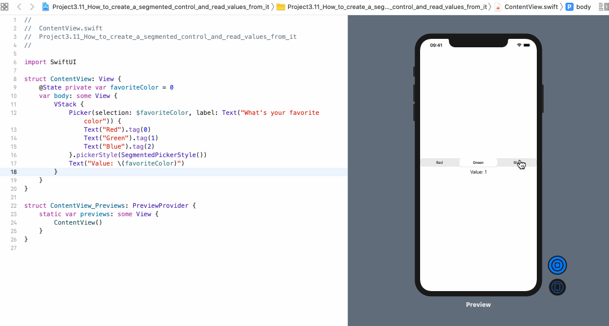
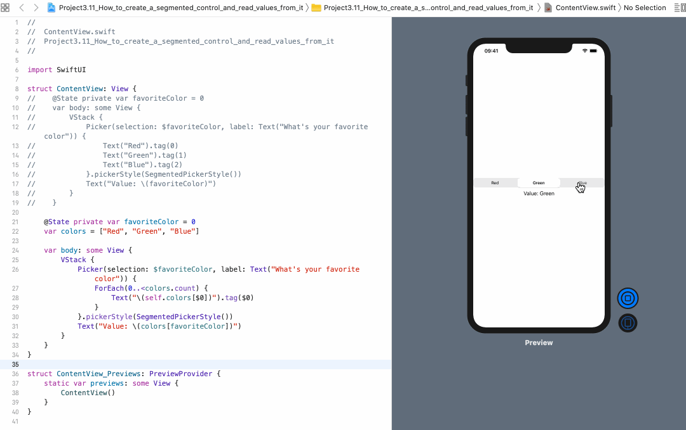

<!-- more -->
### 1. 初识
SwiftUI中 的 `Picker` 还可以用来创建与 UIKit 中的 `UISegmentedControl` 等效的分段控件，尽管它需要绑定到某个状态属性，并且必须确保为每个分段提供一个标记，以便可以对其进行识别。分段可以是文本或者图片，其它任何内容都会自动失败。

### 2. 示例
我们将创建一个分段控件，该控件使用 `favoriteColor` 作为状态属性，并且在下面添加一个文本视图，用于显示所选的任何值:
```swift
struct ContentView: View {
    @State private var favoriteColor = 0
    var body: some View {
        VStack {
            Picker(selection: $favoriteColor, label: Text("What's your favorite color")) {
                Text("Red").tag(0)
                Text("Green").tag(1)
                Text("Blue").tag(2)
            }.pickerStyle(SegmentedPickerStyle())
            Text("Value: \(favoriteColor)")
        }
    }
}
```
效果预览:


不过，在本例中，我们最好创建一个数组来存储各种颜色，然后使用 _foreach_ 在内部使用循环创建文本视图:
```swift
struct ContentView : View {
    
    @State private var favoriteColor = 0
    var colors = ["Red", "Green", "Blue"]
    
    var body: some View {
        VStack {
            Picker(selection: $favoriteColor, label: Text("What's your favorite color")) {
                ForEach(0..<colors.count) {
                    Text("\(self.colors[$0])").tag($0)
                }
            }.pickerStyle(SegmentedPickerStyle())
            Text("Value: \(colors[favoriteColor])")
        }
    }
}
```
效果预览:

